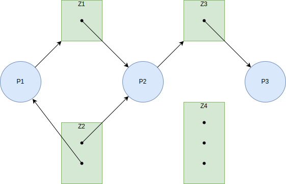
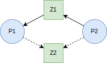

\title{Deadlock}
\author{Patryk 45118641800f7466ecce781cbda2de6f6d79eca9}
\date{04 Jan 2022}

\renewcommand*\contentsname{Spis treści}

\maketitle
\tableofcontents

\newpage

# Wstęp

Systemy wykonujące wiele procesów, udostępniają im zasoby, które mogą zostać przydzielone procesom. Gdy proces nie otrzyma zasobu od razu, będzie na niego oczekiwał. Sytuacja, w której jeden proces oczekuje na zasób w nieskończoność, nazywa się **deadlock**.

W tej notatce opisane zostaną metody zapobiegania lub rozwiązywania problemów z **deadlock**’ami.

# Model systemu

W systemach operacyjnych istnieje skończona ilość zasobów, możliwych do rozdysponowania procesom. Zasoby takie mogą mieć wieleinstancji. O ile to możliwe, proces nie powinien prosić o dokładną instancję zasobu. Przykładowo, w systemie mogą być dwie drukarki, w takim razie proces powinien poprosić o drukarkę, a nie tylko o np. "HP Printer 2137". Takie działanie zmniejsza szansę na powstanie *deadlock*’a.

Podczas standardowej pracy proces powinien postępować z zasobem w następujący sposób:

1.  *Zgłosić zapotrzebowanie*. Zasób może zostać przydzielony natychmiastowo, a gdy to nie możliwe, proces zostaje zamrożony w tej fazie do momentu otrzymania wymaganego zasobu.
2.  *Użytkować*. Po przydzieleniu zasobu proces powinien wykonywać na nim operacje, aby jak najszybciej go zwolnić.
3.  *Zwolnić*. Gdy zasób nie jest już wymagany, należy go zwolnić.

Proces zgłaszania zapotrzebowania oraz zwalniania zasobu może być realizowany przez jądro systemowe. Taką funkcjonalność implementuje się z użyciem *MUTEX*’ów oraz *Semaphore*’ów, system operacyjny dodatkowo sam implementuje takie funkcje dla niektórych zasobów.

# Charakterystyka Deadlock’ów

## Warunki niezbędne

*Deadlock* może zaistnieć, gdy spełnione są odpowiednio warunki:

1.  *Wzajemne wykluczenie* (**Mutual Exclusion**). Niewspółdzielony zasób jest zajęty przez jeden proces, a pozostałe procesy muszą na niego oczekiwać.
2.  *Posiadanie i oczekiwanie* (**Hold and Wait**). Proces posiadający zasób oczekuje na dostęp do innych zasobów.
3.  *Nie przerywany zasób* (**No preemption**). Zasób, którego wymaga proces, jest nieprzerywalny (nie można go “zabrać” innemu procesowi). Zwolniony zostanie on, gdy dany proces zakończy swoje działanie.
4.  *Zapętlone oczekiwanie* (**Circular wait**). Powstaje, gdy n procesów (n >= 2) wymaga zasobów blokowanych przez siebie nawzajem.

## Graf przyznawania zasobów

*Deadlock*’i można przedstawić na grafie przyznawania zasobów, nazywanym również **system resource-allocation graph**. Rolę wierzchołka pełnią procesy oraz zasoby. Krawędzie obrazują relację procesu z zasobem. Strzałka wskazująca na zasób informuje, że proces oczekuje na dany zasób. Strzałka wskazująca na proces wskazuje, że zasób został przydzielony procesowi. Dla lepszej wizualizacji wektorów stosuje się kształt kółka, gdy przedstawiany jest proces, a zasób reprezentuje się w prostokącie. Zasoby mogą zawierać kropki wewnątrz wektora, aby reprezentować pojedyncze instancje.

Przykład grafu:

| Proces | Wymagane zasoby |
| --- | --- |
| P1  | Z1, Z2 |
| P2  | Z1, Z2, Z3 |
| P3  | Z3  |

| Zasób | Ilość | Przydzielony |
| --- | --- | --- |
| Z1  | 1   | P2  |
| Z2  | 2   | P1, P2 |
| Z3  | 1   | P3  |
| Z4  | 3   |     |



Aby znaleźć *deadlock*’a używając grafu, należy rozpatrzeć wszystkie możliwe trasy, zgodnie ze strzałkami. Jeśli któraś z tras się zapętla, oznacza to, iż istnieje tam *deadlock*.

Wszystkie możliwe trasy dla ww. przykładu, zaczynając od procesu P1:

P1 → Z1 → P2 → Z3 → P3

Jak widać, istnieje tylko jedna trasa, która się nie zapętla. Aby jednak uzyskać *deadlock*’a, można połączyć proces P3 z zasobem Z2:


W tym wypadku trasa wygląda następująco: P1 → Z1 → P2 → Z3 → P3 → Z2 → ( P1 lub P2 ). W tym przypadku zasób Z2 połączył koniec trasy z dowolnym wierzchołkiem na nim leżącej. Jest to równoznaczne z istnieniem zapętlenia.

# Metody obsługi deadlock’ów

Z *deadlock*’ami można postąpić na trzy sposoby:

- Utworzyć algorytmy zapobiegania deadlock’om.
- Utworzyć algorytm wykrywania deadlock’ów oraz rozwiązywania ich.
- Nie ingerować w ich działanie.

W praktyce wiele systemów nie ingeruje w deadlock’i. Wykonywany proces powinien sam sprawdzać, czy nie spełniono wszystkich warunków na uzyskanie deadlock’a.

W celu zapobiegania deadlock’om w systemie stosuje się **deadlock prevention** lub **deadlock avoidance**. **Deadlock prevention** udostępnia metody zapewniające, że przynajmniej jeden z *warunków niezbędnych* do powstania deadlock’ów nie został spełniony. **Deadlock avoidance** wymaga podania przez proces dodatkowych informacji o zasobach, jakie wymaga do wykonania swoich operacji.

# Zapobieganie deadlock’om

## Mutual Exclusion (MUTEX)

Jest to jeden z pierwszych warunków uzyskania deadlock’a. Zasoby zabezpieczone *mutex*’em nie mogą pozwolić na dostęp innemu procesowi do takiego zasobu. W tym przypadku nie można zabezpieczyć się przed uzyskaniem deadlock’a. Każda próba zabezpieczania się będzie błędem logicznym zabezpieczenia *mutex*. Możliwe jest jednak przemianowanie zasobu na współdzielony (o ile jest to możliwe). Zasób taki będzie mógł być przydzielony nieskończonej liczbie procesów. Przykładem takiego zasobu jest plik z uprawnieniami Read-Only (tylko do odczytu).

## Hold and Wait

Warunek **hold and wait** jest spełniony, wtedy gdy proces posiada zablokowane zasoby i dodatkowo wymaga kolejnych.

Sposobem na rozwiązanie takiego problemu jest deklaracja zasobów przed wykonaniem operacji. W takim wypadku system posiada listę zasobów, jakie są wymagane przez proces, i może je odpowiednio rozdysponować, aby uniknąć *deadlock*’a. Można to dodatkowo usprawnić o możliwość ponownego uzyskania zasobów, gdy proces zwolni poprzednie.

## No Preemption

Nie możliwym jest zabranie zasobów innemu procesowi.

Rozwiązaniem takiego problemu jest dobrowolne zwolnienie własnych zasobów na rzecz innych procesów. Jeśli proces wymagający dodatkowych zasobów, nie otrzyma wszystkich, to dobrowolnie zwalnia wszystkie swoje poprzednie. Dodatkowo oczekuje on aż wszystkie wymagane zasoby, będą dostępne, wraz z poprzednimi, po czym je zajmuje. Dzięki takiemu dobrowolnemu zwalnianiu zasobów inny proces może zapełnić swoją listę wymaganych zasobów i skończyć swoje działanie.

## Circular Wait

Warunek **circular wait** jest spełniony, gdy dwa procesy naprzemiennie blokują i wymagają swoich zasobów. Przykładowo, proces P1 posiada zasób Z1 i wymaga Z2. Proces P2 posiada Z2 i wymaga Z1. Taki stan zapotrzebowania zasobów jest niemożliwy do rozwiązania.

Aby uniknąć takich sytuacji, zasoby można uporządkować szeregowo i nakazać procesowi pobierać je pokoleji. Dokonuje się tego poprzez nadanie zasobom unikatowego numeru. Proces może wtedy poprosić tylko o zasób z numerem wyższym niż poprzedni. Przykładowo, w systemie znajdują się zasoby Z1, Z2, Z3 oraz Z4. Proces wymaga zasoby Z2 oraz Z4, zgodnie z powyższym algorytmem, proces nie może poprosić o zasoby w kolejności Z4, Z2, gdyż 2 nie jest większe od 4. Poprawną sekwencją zasobów jest Z2, Z4.

# Unikanie deadlock’ów

Opisane w poprzedniej sekcji metody zapobiegania deadlock’om, narzucały metodę zgłaszania zapotrzebowania na zasoby. Był to typowo procesowy system zabezpieczania. W tej sekcji przedstawione zostaną systemowe algorytmy przydziału zasobów. Jedynym wymogiem od procesu, jest podanie maksymalnej ilości zasobu każdego typu, jakiego potrzebuje.

## Bezpieczny stan

*Sekwencja bezpieczna* (**safe sequence**) to sytuacja, w której ułożenie procesów nie pozwala na zaistnienie deadlock'owi. Wyróżnia się również *sekwencję niebezpieczną* (**unsafe sequence**), w niej może, ale nie musi dojść do deadlock’a. *Sekwencja bezpieczna* jest osiągana, gdy zasoby zwolnione z jednego procesu pozwalają na zaspokojenie potrzeb drugiego procesu.

Przykładowo, w systemie znajduje się zasób Z oraz 3 procesy (P1, P2, P3). Zasób Z ma 12 instancji, a procesy wymagają odpowiednio 10, 4, 9 zasobów. Aktualnie przydzielone mają odpowiednio 5, 2, 2 zasobów.

| Proces | Ilość wymaganych zasobów | Ilość posiadanych zasobów | Pozostało do przydzielenia |
| --- | --- | --- | --- |
| P1  | 10  | 5   | 5   |
| P2  | 4   | 2   | 2   |
| P3  | 9   | 2   | 7   |

W takiej sytuacji jedyną *bezpieczną sekwencją* jest P2, P1, P3. Wolne zostają 3 zasoby, którymi tylko proces P2 może zapełnić swoje maksimum i skończyć działanie. Gdy P2 skończy działanie, to zwalnia zasoby, wolnych jest już 5. Kolejnym procesem jest P1, gdyż wymaga on dokładnie 5 zasobów, po jego zakończeniu wolnych zostaje 10 zasobów. Teraz możliwe jest przydzielenie 7 brakujących zasobów dla P3. Po zakończeniu procesu P3 wszystkie 12 zasobów jest wolnych.

## Resource-Allocation-Graph

Każdy zasób może mieć wiele instancji, ale zdarzają się przypadki, gdy zasób może mieć dokładnie jedną instancję. Łatwo jest to zobrazować na grafie przyznawania zasobów, dodając krawędź wolnego żądania zasobu. Krawędź taka jest oznaczana przerywaną linią i wychodzi zawsze od procesu do zasobu. Może ona zaistnieć, gdy zasób nie został przydzielony żadnemu procesowi.

Przykład, proces P1 posiada przydzielony zasób Z1 oraz żąda Z2. Proces P2 natomiast żąda obydwu zasobów Z1 oraz Z2.



Na grafie takim można łatwo zauważyć, iż proces P1 posiada przydzielony jeden zasób i posiada jedną krawędź wolnego żądania. Wiadomo już, że zasób Z2 powinien zostać przydzielony procesowi P1, gdyż spełni to wszystkie jego wymagania.

## Algorytm Bankowy

Nazwa algorytmu bankowego pochodzi od początkowego miejsca stosowania takiego algorytmu. Mianowicie stosowano go pierwotnie w bankach.

Proces przed rozpoczęciem pracy musi zdefiniować maksymalną ilość instancji każdego z zasobów, jakie będzie używał. Ilość instancji nie może być większa niż dostępna w systemie.

System tworzy struktury danych w postaci wektora i matrycy. Dla ułatwienia przyjmijmy, iż:

- *p* \- ilość procesów
- *z* \- ilość zasobów
- *q* \- numer procesu
- *r* \- numer zasobu

Tworzone struktury to:

- **Dostępne zasoby**. Jest to wektor o długości *z*, zawiera ilość dostępnych instancji określanego zasobu.
- **Maksimum**. Jest to matryca dwu wymiarowa o wielości *p* x *z*. Zawiera maksymalne ilości instancji zasobu *r* możliwych do zajęcia przez proces *q*.
- **Alokacja**. Jest to matryca dwu wymiarowa *p* x *z*. Zawiera ilość instancji zasobu *r* zajętych przez proces *q*.
- **Zapotrzebowanie**. Jest to matryca dwu wymiarowa *p* x *z*. Zawiera ilość instancji zasobu *r* wymaganych przez proces *q*. Można ją uzyskać poprzez różnicę matryc **maksimum** oraz **alokacja**.

### Algorytm bezpieczeństwa

```R
Krok 1: Deklaracja wektora 'koniec' o długości p, wypełnionego wartościami false.

Krok 2: Dla każdego q wykonuje się warunek: koniec[q] == false && zapotrzebowanie[q] <= dostępne_zasoby, jeśli jest on prawdziwy, to przechodzi do kolejnego kroku, jeśli nie sprawdza kolejne q.

Krok 3: dostępne_zasoby += alokacja[q]
        koniec[q] = true
        Przeskakuje do kroku 2

Krok 4: Gdy koniec[q] == true dla każdego q to osiągnięto bezpieczną sekwencję.
```

### Algorytm Resource-Request

Zmienna *doPrzdzielenia* jest matrycą o długości *p* x *z*. Zawiera ilość instancji zasobu *r* o przydzielenie których poprosił proces *q*.

```R
Wykonywane dla każdego q:

Krok 1: Gdy doPrzydzielenia[q] <= zapotrzebowanie[q], przechodzi do kolejnego kroku, w przeciwnym wypadku zwraca błąd.

Krok 2: Gdy doPrzydzielenia[q] <= dostępne_zasoby, przechodzi do kolejnego kroku, w przeciwnym wypadku oczekuje na uzyskanie zasobów.

Krok 3: System przydziela wymagane zasoby procesowi. I przechodzi do kolejnego kroku.

Krok 4: dostępne_zasoby -= doPrzydzielenia[q]
        alokacja[q] += doPrzydzielenia[q]
        zapotrzebowanie[q] -= doPrzydzielenia[q]
```

# Wykrywanie deadlock'a

Gdy system nie implementuje żadnej metody zapobiegania lub unikania deadlock’ów, może dojść do ich wystąpienia. System może stosować różne algorytmy wykrywania deadlock’ów, zależą one głównie od charakterystyki zasobów.

## Zasoby jednoinstancyjne

Jeśli zasoby systemowe mają wyłącznie jedną instancję, można skorzystać ze zmodyfikowanego grafu przyznawania zasobów. W przeciwieństwie do standardowego grafu ten nie prezentuje zasobów. Dodatkowo zakłada się, iż wszystkie zasoby zostały przydzielone procesom. Krawędź w tym grafie wychodzi od procesu wymagającego danego zasobu do procesu posiadającego dany zasób. Takie założenia pozwalają na szybsze rozpatrywanie zapętleń zasobów.

## Zasoby wieloinstancyjne

W przypadku zasobów wieloinstancyjnych należy skożystać ze zmodyfikowanego algorytmu *Bankowego*.

Odnośnie do wartości pomocniczych przyjmujemy, że:

- *p* \- ilość procesów
- *z* \- ilość zasobów
- *q* \- numer procesu
- *r* \- numer zasobu

Tworzone struktury to:

- **Dostępne zasoby**. Jest to wektor o długości *z*, zawiera ilość dostępnych instancji określanego zasobu.
- **Alokacja**. Jest to matryca dwu wymiarowa *p* x *z*. Zawiera ilość instancji zasobu *r* zajętych przez proces *q*.
- **Przydział**. Jest to matryca o długości *p* x *z*. Zawiera ilość instancji zasobu *r* o przydzielenie których poprosił proces *q*.

Algorytm:

```R
Krok 1: Dla każdego q: koniec[q] = (false if alokacja != 0 else true)

Krok 2: Jeśli koniec[q] == false && przydział[q] <= dostępne_zasoby przechodzi do kroku 4 w przeciwnym wypadku do kroku 3

Krok 3: dostępne_zasoby += przydział[q]
        koniec[q] = true
        Przejdź do kroku 2

Krok 4: Jeśli koniec[q] == false jest prawdą dla dowolnego q, jest to równoznaczne z istnieniem deadlocka. Wiadomo dodatkowo, iż to proces o numerze q jest zablokowany.
```

## Używanie algorytmów wykrywania deadlock’ów

Jak każdy algorytm ten również zużywa moc obliczeniową. Nie zalecane jest uruchamianie takiego algorytmu w bardzo krótkich odstępach czasu. Warto jest jednak wykonać taką operację raz na 5 min lub gdy wydajność procesora spada poniżej ustalonej wartości, przykładowo 50%.

# Rozwiązanie deadlock’a

Gdy algorytm wykrywania deadlock’ów zaóważy takowe, system może podjąć działania w celu ich rozwiązania. Istnieją dwie metody rozwiązań takich problemów, jest to zakończenie działania procesu oraz przymusowe zwolnienie zasobu.

## Zakończenie procesu

Aby zakończyć działanie procesu kożysta się z dwóch metod:

- *Zakończenia wszystkich deadlock’owanych procesów*. Wadą takiego rozwiązania jest przerwanie wielu procesów, które już wykonały określone obliczenia. Ponowne uruchomienie procesu spowoduje wykonanie takich samych obliczeń.
- *Zakańczanie jednego procesu do momenu rozwiązania deadlock’a*. Wadą tego rozwiązania jest wymóg wielokrotnego wykonania operacji wyszukiwania deadlock’owanych procesów.

Problemami zakańczania procesu dodatkowo jest niespójność danych oraz wybranie odpowiedniego procesu. Podczas zatrzymania procesu może dojść do niespójności, gdy ten zapisywał dane. Systemy operacyjne w takich przypadkach implementują różne sygnały przerwania, które dają procesowi chwilę czasu na zakończenie działania. Natomiast wybór procesów do zamknięcia może być definiowany przez wagę procesu, na którą wpływa:

- Jaki proces posiada priorytet?
- Jak długo proces prowadzi obliczenia?
- Jak wiele oraz jakie zasoby są wykorzystywane?
- O ile więcej proces potrzebuje zasobów?
- Ile procesów musiałoby zostać przerwane, aby zwolnić wymagane zasoby?
- Czy proces jest interaktywny, czy pracuje w tle?

## Przerywanie zasobów

W celu wyeliminowania deadlock’ów tą metodą niektóre zasoby są zabierane innym procesom i przydzielane innemu. Operacja taka jest powtarzana do momentu przerwania zapętlonego cyklu.

Głównymi problemami przerywania zasobów jest:

1.  *Wybór zasobu*. W celu zredukowania ryzyka, określone zasoby powinny zostać zwolnione. Można zastosować system przyznawania punktów.
2.  *Przywracanie*. Jeśli jakiemuś procesowi zabrane zostaną zasoby, to powinny one do niego wrócić. Nie zawsze jednak proces będzie działał poprawnie po przerwaniu swoich zasobów. W takim wypadku należy utworzyć punkt przywracania procesu.
3.  *Zapętlenie*. Zasoby zwolnione z jednego procesu mogą być przez niego ponownie zajęte. Należy więc zabezpieczyć się przed możliwością zablokowania zasobów przez proces, z którego zostały one zwolnione.

# Bibliografia

---
notice: |
	@Silberschatz2006
...
