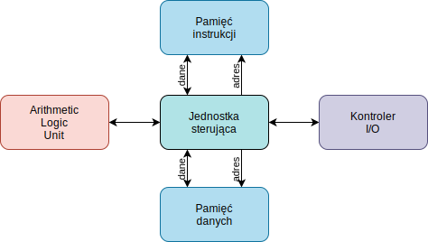
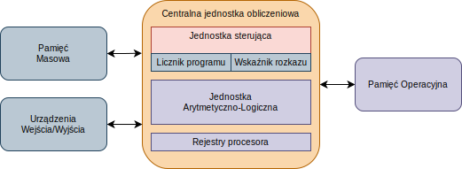

\title{Historia procesorów}
\author{Patryk 45118641800f7466ecce781cbda2de6f6d79eca9}
\date{09 Feb 2022}

\renewcommand*\contentsname{Spis treści}

\maketitle
\tableofcontents

\newpage

# Wstęp

Komputery to nieodłączna część życia współczesnego człowieka. Występują one w różnych formach, od serwerów, przez komputery osobiste, kontrolery linii produkcyjnych aż po żarówki LED (IoT). W tej notatce zostanie opisana historia technologii procesorów jak i pierwotnych komputerów.

# Ogólne koncepcje

## Maszyna Turinga

Koncepcja maszyny Turinga zakładała abstrakcyjny model urządzenia do wykonywania algorytmów. Urządzenie koncepcyjne miało posiadać głowicę będącą w stanie zapisywać i odczytywać dane z nieskończenie długiej taśmy. Sterowanie taką głowicą powierzone miało być specjalnemu modułowi sterowania. Który przyjmował oraz interpretował rozkazy pobierane odpowiednio z taśmy.

Bazowymi koncepcjami operacji maszyny były:

- Operacje arytmetyczne (tj. Dodawanie, Odejmowanie, Mnożenie).
- Sekwencje wykonywanych operacji (tzn. wykonanie bardziej złożonych operacji z wykorzystaniem podstawowych).
- *N* krotna powtarzalność operacji.
- Warunkowa iteracja (dzisiejsza znana jako instrukcja *if*).
- Transfer (tzn. przejście do innego miejsca w kodzie, znane również jako *goto*).

## Architektura Harwardzka

Architektura Harwardzka zakładała istnienie pięciu modułów: pamięci instrukcji, pamięci danych, *Arithmetic Logic Unit* (**ALU**), kontroler urządzeń wejścia wyjścia oraz jednostkę kontrolującą pracę. Głównym modułem jest *mechanizm kontrolujący*, który łączy wszystkie pozostałe cztery moduły.

Schemat architektury Harwardzkiej:

## Architektura Von Neumanna

Architektura Von Neumanna zakładała istnienie:

- Centralnej jednostki obliczeniowej (*CPU*), składającej się z:
    - *Arithmetic Logic Unit* (**ALU**)
    - Rejestrów
    - Mechanizmu kontrolującego pracę procesora, zawierającego dodatkowo:
        - Licznik programu
        - Wskaźnik rozkazu
- Jednostki pamięci (*RAM*), zawierającej:
    - Dane
    - Instrukcje
- Urządzeń I/O
- Zewnętrznej pamięci masowej

W przeciwieństwie do architektury Harwardzkiej architektura Von Neumanna przechowuje dane oraz instrukcje w jednej pamięci, co prowadzi do pewnych komplikacji. Mianowicie, podczas używania dwóch niezależnych pamięci można jednocześnie odczytywać instrukcję oraz zapisywać/odczytywać dane. Jest to jedna z zalet architektury Harwardzkiej nad Von Neumanna.

Schemat architektury Von Neumanna:

# Pierwowzory współczesnych komputerów

## Z1 (1938 r.)

Z1 był pierwszym programowalnym komputerem należącym do grupy *komputerów zerowej generacji*. W grupie tej zawierały się wszystkie maszyny obliczeniowe, które nie posiadały aktywnych elementów elektronicznych lub nie były ogólnego przeznaczenia.

Wykorzystywał on liczby zmiennoprzecinkowe. Pomimo tego nie spełniał koncepcji maszyny Turinga, gdyż nie obsługiwał instrukcji warunkowych[^Z13-IS]. Instrukcje warunkowe były wymagane do obsługi zapętleń programu, realizowano to jednak poprzez złączenie dwóch końców taśmy perforowanej[^Z13-IS].

Architektura komputera była bardzo zbliżona do architektury Von Neumanna, która nie została utworzona przed komputerem Z1[^Z13-I].

Programy tworzone były na ośmiokanałowej taśmie perforowanej[^Z13-IS], a pamięć była mechaniczna. Jej była inna, iż we wszystkich budowanych komputerach w tamtym okresie. Wykorzystano małe blaszki zamiast kół zębatych. Rozwiązanie to pozwoliło na zmniejszenie rozmiaru pamięci i osiągnięcie pojemności 64 22-bitowych liczb (łącznie 1408-bitów)[^Z13-BS].

Liczby, na których operował komputer były 22-bitowe. Składały się one z jedno bitu znaku, siedmiu bitów wykładnika oraz czternastu bitów mantysy[^Z13-Fig2]. Taki format pozwalał na zapisanie liczby z zakresu od 2-63(~1.08 \* 10-19) do 1.999 \* 262(~9.2 \* 1018)[^Z13-FPR].

Komputer Z1 obsługiwał osiem rozkazów[^Z13-Table1] :

| Instrukcja | Opis | Kod operacji |
| --- | --- | --- |
| Lu | Odczytanie danych z klawiatury | 01 110000 |
| Ld | Wypisanie wyniku | 01 111000 |
| Pr z | Wczytanie danych z adresu **z** | 11 zzzzzz |
| Ps z | Zapisanie danych na adres **z** | 10 zzzzzz |
| Lm | Mnożenie | 01 001000 |
| Li | Dzielenie | 01 010000 |
| Lw | Pierwiastkowanie | 01 011000 |
| Ls1 | Dodawane | 01 100000 |
| Ls2 | Odejmowanie | 01 101000 |

W roku 1941 zbudowany został komputer Z3. Bazował on już na elementach elektrycznych, co zmniejszyło jego rozmiar i zwiększyło wydajność. Pod względem architektury nie różnił się on znacząco od Z3.

[^Z13-Table1]: The Architecture of the Z1 and Z3: Tabela 1
[^Z13-Fig2]: The Architecture of the Z1 and Z3: Ilustracja 2
[^Z13-FPR]: The Architecture of the Z1 and Z3: Floating-Point Representation (str. 7)
[^Z13-IS]: The Architecture of the Z1 and Z3: Instruction Set
[^Z13-I]: The Architecture of the Z1 and Z3: Introduction (str. 5)
[^Z13-BS]: The Architecture of the Z1 and Z3: Block Structure

## ENIAC (1945 r.)

ENIAC, czyli *Electronic Numerical Integrator and Computer*, to *komputer pierwszej generacji*. Charakteryzowały się on wykorzystywaniem lamp elektronowych.

ENIAC wykorzystuje dziesiętny system liczbowy[^ENIAC-2]. Jako urządzenie wejścia posiada czytnik a na wyjściu drukarkę kart perforowanych[^ENIAC-2]. Program przekazany do wykonania komputerowi nie jest ładowany z pamięci zewnętrznej a pisany statycznie poprzez zmianę położenia odpowiednich przełączników[^ENIAC-2]. Rozwiązanie to utrudniało zmianę algorytmów przeznaczonych do wykonania, gdyż wymagane było każdorazowe przeprogramowanie. Dopiero w 1947 roku wykorzystano wcześniej istniejące tablice funkcji, aby przechowywały nie tylko stałe dane, ale też i instrukcje[^ENIAC-8]. Innym znaczącym problemem ENIAC'a był brak pamięci operacyjnej. Częściowo rozwiązywano to poprzez zapisywanie danych na karcie perforowanej – jako pamięci jednokrotnego zapisu – a następnie przekładano tę kartę do czytnika[^ENIAC-2]. Dodatkowo moduł tablicy funkcji udostępniał statyczne dane, co dawało efekt pamięci typu ROM[^ENIAC-7]. Głównym modułem, który zarządzał pracą komputera, był *Master Programmer*. To za jego pomocą wykonywano instrukcje warunkowe i kontrolowano pętle, mógł on również przerwać działanie całego komputera[^ENIAC-4].  Najczęściej występującymi modułami w ENIAC'u były rejestry nazywane *accumulator*, gdyż umożliwiały one dodawanie i odejmowanie liczb[^ENIAC-3]. Operację mnożenia zrealizowano z wykorzystaniem tabliczki mnożenia 10 na 10[^ENIAC-5]. Algorytm bardzo przypominał mnożenie pisemne, gdyż operacje wykonywano dla każdej z liczb wraz z przesunięciem o określone miejsce dziesiętne. Podobnie swoje obliczenia wykonywała jednostka dzielenia, z tą różnicą, iż przesuwała swój mianownik do momentu przekroczenia wielkości licznika[^ENIAC-6]. Taki algorytm również stosowany jest podczas dzielenia pisemnego.

[^ENIAC-2]: The Electronic Numerical Integrator and Computer: 2 Arhictecture Overview
[^ENIAC-3]: The Electronic Numerical Integrator and Computer: 3 Accumulators
[^ENIAC-4]: The Electronic Numerical Integrator and Computer: 4 Master Programmer
[^ENIAC-5]: The Electronic Numerical Integrator and Computer: 5 Multiplication Units
[^ENIAC-6]: The Electronic Numerical Integrator and Computer: 6 Division / Square Unit
[^ENIAC-7]: The Electronic Numerical Integrator and Computer: 7 Function Tables
[^ENIAC-8]: The Electronic Numerical Integrator and Computer: 8 The ENIAC as a Stored Program Computer

## PDP-8 (1965 r.)

PDP-8 był komputerem wykorzystującym układy scalone, co zalicza go do grupy *komputerów trzeciej generacji*.

PDP-8 jako jeden z pierwszych komputerów implementował rozwiązania znane w dzisiejszych komputerach. Jego bazowa pamięć operacyjna miała rozmiar 212 słów 12-bitowych (~6kB)[^HSDC-CM] i mogła zostać rozszerzona do 215 słów (~49kB)[^HSDC-MECT]. Taka potencjalna przestrzeń adresowa została pomniejszona logicznie, poprzez podzielenie pamięci na 128 wyrazowe strony[^HSDC-MECT]. W celu określenia, jaka strona pamięci jest aktualnie w użytku, stosowano pierwsze pięć bitów z rejestru *Program Counter*[^SCHB-MA]. Z ich pomocą możliwe było utworzenie adresu fizycznego, poprzez sumę adresu logicznego wraz z numerem strony, przesuniętym o 7-bitów. Taka implementacja paginacji pozwalała wykorzystać pełne 12-bit instrukcji wraz z zawarciem w nim adresu logicznego[^HSDC-MRIF]. Adresacja pamięci dawała łatwy dostęp do zerowej strony pamięci, gdyż z pomocą jednego bitu określano stronę, do której się odwołać. PDP-8 implementował również pierwowzór współczesnej pamięci cache, wykorzystując dodatkowe rejestry[^SCHB-CO]. Dostępne były również przerwania, służące szybszemu rozpoczęciu wykonywania określonego procesu[^SCHB-PI].

[^HSDC-MRIF]: A High Speed Digital Computer – PDP-8: Fig. 4, str. 10
[^HSDC-CM]: A High Speed Digital Computer – PDP-8: Core Memory, str. 7
[^HSDC-MECT]: A High Speed Digital Computer – PDP-8: Memory Extension Control Type, str. 16

[^SCHB-MA]: Small Computer Hand Book: Memory Addressing, str. 101
[^SCHB-CO]: Small Computer Hand Book: Computer Organization, str. 84
[^SCHB-PI]: Small Computer Hand Book: Program Interrupt, str. 11

# Procesory i technologie komputerowe

## Intel 4004 (1971 r.)

4004 był pierwszym procesorem firmy Intel. Klasyfikowany był jako 4-bitowy procesor wysokiej skali integralności. Jego słowa były cztero, instrukcje osmio a adresy dwunasto bitowe[^MCSUM-IIIA]. Instrukcje mogły występować pojedynczo (8 bit) lub podwójne (16 bit) a każda z nich podzielona była na bloki 4-bitowe[^MCSUM-IIIB1A]. Pierwszy blok nazywany *OPR* zawierał kod operacji, drugi natomiast nazywany *OPA* zawierał modyfikatory lub dane adresowe[^MCSUM-IIIB1A]. W przypadku podwójnych instrukcji pozostałe dwa bloki zawierały część adresu lub dane[^MCSUM-IIIB1A]. Taka metoda zapisu instrukcji jest wykorzystywana do dziś w architekturze x86, gdyż jest optymalna pod względem dekodowania. Procesor 4004 udostępnia również szesnaście rejestrów ogólnego przeznaczenia, gdzie rejestr *A* służy głównie do wykonywania operacji w ALU. Efekt tej funkcjonalności jest widoczny do dziś, gdyż architektura x86 udostępnia niektóre instrukcje operujące arytmetycznie domyślnie na rejestrze A.

[^MCSUM-IIIA]: MCS-4 Micro Computer Set – User Manual: III-A Description, str. 7
[^MCSUM-IIIB1A]: MCS-4 Micro Computer Set – User Manual: III-B-1-A Machine Instructions, str. 10

## Intel 8008 (1972 r.)

Intel 8008 to pierwszy procesor 8-bitowym firmy Intel. Jego adresy są 14-bitowe, a słowa i instrukcje 8-bitowe. Częstotliwość pracy zegara wynosi od 200kHz do 800kHz, lecz czas potrzebny na wykonanie instrukcji jest dłuższy niż w 4004[^WIKI-8008-D]. 8008 otrzymał nowe flagi warunku, wcześniej posiadane *Carry* (pożyczono bit) oraz nowe: *Pair* (liczba parzysta), *Zero* (wynik równy zero) oraz *Sign* (liczba ujemna)[^WIKI-8008-IR]. Powiększono stos wywołań do siedmiu poziomów[^WIKI-8008-DF]. Zredukowano natomiast ilość rejestrów ogólnego przeznaczenia do siedmiu. Tak jak w 4004 rejestr A pełni rolę kontenera na dane przeznaczone do operacji arytmetycznych[^WIKI-8008-DF].

[^WIKI-8008-D]: Wikipedia – Intel 8008: Design
[^WIKI-8008-DF]: Wikipedia – Intel 8008: Design – Features
[^WIKI-8008-IR]: Wikipedia – Intel 8008: Intel 8008 registers 

## Intel 8086 (1978 r.)

Intel 8086 był rewolucyjnym procesorem firmy Intel.

8086 posiada architekturę 16-bitową, mogącą adresować 216 bajtów (65KiB) w trybie *MIN* lub 220 bajtów (1MiB) w trybie *MAX*[^8086FUM-2.1]. W porównaniu do 8008, 8086 szybciej wczytuje swoje instrukcje, co jest spowodowane zaimplementowaniem metody ładowania z wyprzedzeniem[^8086FUM-2.2]. Polega ona na ładowaniu kolejnych instrukcji w trakcie wykonywania aktualnych przez jednostkę sterującą. Natomiast bufor jest w stanie pomieścić maksymalnie 6 bajtów instrukcji[^8086FUM-2.2-BIU]. W celu skrócenia czasu dostępu – tj. we wcześniejszych modelach – zastosowano rejestry ogólnego przeznaczenia. Jest ich 4, każdy z nich 16-bitowy a niektóre są dodatkowo podzielone na mniejsze sekcje, górną oraz dolną[^8086FUM-2.2-GR]. Programista ma dostęp jeszcze do 4 rejestrów, jest to wskaźnik na stos oraz dwa indeksy danych[^8086FUM-2.2-GR]. Każdy z rejestrów jest przystosowany do wykonywania na nim określonych operacji arytmetycznych[^8086FUM-2.2-GR]. Wspomniane wcześniej indeksy służą do nawigowania po danych. W celu ułatwienia adresacji procesor udostępnia mechanizm segmentacji, w którym segment może mieć rozmiar maksymalnie 216 bajtów (16KiB)[^8086FUM-2.2-SR]. Do zlokalizowania tych segmentów w pamięci, wykorzystuje się – przesunięte o 4 bity – początki ich adresów[^8086FUM-2.2-SR]. Rejestr *Code Segment* wskazuje na segment z instrukcjami, *Data Segment* zawiera początek segmentu z danymi programu, *Stack Segment* określa położenie stosu, *Extra Segment* zawiera adres dodatkowego segmentu, który może zostać użyty jako blok danych[^8086FUM-2.2-SR]. Tak jak segmenty danych posiadają swoje indeksy, tak i segment kodu go posiada. *Instruction Pointer* wskazuje jaka kolejna instrukcja ma zostać wykonana[^8086FUM-2.2-IP]. W porównaniu do *Program Counter* zawiera on offset od początku segmentu kodu, na którym znajduje się kolejna instrukcja przeznaczona do zdekodowania, a następnie wykonania[^8086FUM-2.2-IP]. Bardzo przydatnym rejestrem dla programisty jest rejestr zawierający flagi. Procesor 8086 posiada rejestr, który przechowuje dziewięć flag, gdzie trzy są flagami kontrolnymi a pozostałe sześć są flagami statusu[^8086FUM-2.2-F].

Do flag kontrolnych zalicza się:
- *Trap* – Przełącza procesor w tryb jedno krokowy, służący debugowaniu.
- *Direction* – Określa kierunek zapisu danych w segmencie, czy zaczynają się od końca, czy od początku (Nie to samo co Little Endian lub Big Endian!).
- *Interrupt-Enable* – Określa czy otrzymane przerwania mają być przyjmowane, czy też odrzucane.

Flagi statusu dotyczą wyniku operacji arytmetycznych, a należą do nich:
- *Carry* – Wartość dodatkowego górnego bitu.
- *Parity* – Wynik parzysty.
- *Auxiliary Carry* – Wykonano operacje na sąsiednim bloku pamięci.
- *Zero* – Wynik jest zerem.
- *Sign* – Dana wartość jest ze znakiem (format zapisu).
- *Overflow* – Przekroczono zakres operowanej zmiennej.

[^8086FUM-2.1]: The 8086 Family User's Manual: 2.1 Processor Overview
[^8086FUM-2.2]: The 8086 Family User's Manual: 2.2 Processor Architecture
[^8086FUM-2.2-BIU]: The 8086 Family User's Manual: 2.2 Processor Architecture – Bus Interface Unit
[^8086FUM-2.2-GR]: The 8086 Family User's Manual: 2.2 Processor Architecture – General Registers
[^8086FUM-2.2-SR]: The 8086 Family User's Manual: 2.2 Processor Architecture – Segment Registers
[^8086FUM-2.2-IP]: The 8086 Family User's Manual: 2.2 Processor Architecture – Instruction Pointer
[^8086FUM-2.2-F]: The 8086 Family User's Manual: 2.2 Processor Architecture – Flags

## Intel 386 (1985 r.)

I386 został nowym procesorem Intela, który był 32-bitowy oraz zapoczątkował nową architekturę, IA-32. W porównaniu do wersji 8086 wprowadzono paginację pamięci, dwa tryby pracy, jednostkę zarządzania pamięcią oraz typy danych.

Paginacja jest elementem wirtualnej pamięci, ma za zadanie zamianę adresu liniowego na adres fizyczny[^I386PRM-5.2]. Aktywacja tej funkcjonalności odbywa się poprzez ustawienie flagi *PG* w rejestrze kontrolnym *CR0*[^I386PRM-5.2]. Dla procesorów I386 strony pamięci mają stały rozmiar 4KiB, a ich granica zaczyna się od wskazywanego bajtu[^I386PRM-5.2.1]. Adres, który wskazuje na początek ramki pamięci, jest adresem fizycznym, który mapowany jest z adresu logicznego. Mapowanie odbywa się za pomocą dwupoziomowego hierarchicznego rozkładu tablicy paginacji[^I386PRM-5.2.2]. Najwyższy poziom nazywany jest katalogiem tablic paginacji, jego adres zapisany jest w rejestrze kontrolnym *CR3*[^I386PRM-5.2.3]. Katalog tablic paginacji umożliwia zaadresowanie 210 (1024) obiektów niższego poziomu, nazywanych tablicami paginacji[^I386PRM-5.2.3]. Każda tablica paginacji, jest w stanie wskazać 210 (1024) stron pamięci o wcześniej wspomnianym rozmiarze 212 (4KiB)[^I386PRM-5.2.3]. Taki rozkład tablic paginacji pozwala zaadresować 232 (210 \* 210 \* 212 = 210+10+12) bajtów czyli 4GiB. Dane jakie zostają zapisane w tablicach paginacji to 32-bitowe rekordy. Odczytanie takiego rekordu z pamięci zwiększa ilość cykli potrzebnych na uzyskanie prawidłowych danych. W celu zminimalizowania takiego opóźnienia wykorzystano osobną pamięć cache wyłącznie dla rekordów tablic paginacji[^I386PRM-5.2.5]. Niemożliwym jest bezpośredni dostęp programisty do tej pamięci, może on ją jedynie wyczyścić wykonując operację przeniesienia danych na rejestr *CR3* lub poprzez zmianę wykonywanego zadania[^I386PRM-5.2.5].

Schemat rekordu w tablicy paginacji:

- *Page Address Frame* (20-bit) – Numer ramki w pamięci fizycznej, gdzie pozostałe 12 bitów jest zerami.
- *AVL* (3-bit) – Wskazuje czy strona pamięci jest prawidłowa tzn. czy jest utworzona i adres jest prawidłowy.
- *D* (1-bit) – Informuje czy dana strona pamięci powinna zostać przeniesiona do pamięci SWAP.
- *A* (1-bit) – Określa czy dany rekord jest rekordem katalogu tablic paginacji czy też samych tablic paginacji.
- *U/S* (1-bit) – Warunkuje dostęp do strony pamięci. Jeśli 1 to dostęp do strony ma każdy, gdy 0 dostęp posiada wyłącznie system.
- *R/W* (1-bit) – Określa czy strona pamięci jest tylko do odczytu, czy też do zapisu.
- *P* (1-bit) – Wskazuje czy strona pamięci jest aktualnie w pamięci RAM, czy też w pamięci SWAP.

Domyślnie wcześniejsze procesory (poza 80236) pracowały w trybie *Real Mode*. Charakteryzuje się on możliwością pełnego korzystania z przerwań BIOSU. A wykonywane zapytania do pamięci są szybsze ze względu na brak deskryptorów segmentów oraz paginacji[^I386PRM-14.1]. Wadą tryby rzeczywistego jest ograniczona ilość pamięci do 1MiB, wynikająca z użycia wyłącznie 20 bitów do adresacji (16 bit na segment oraz 4 bit offset)[^I386PRM-14.1]. Tryb adresowania jest bardziej restrykcyjny, gdyż należy przewidywać czy dane w tym miejscu już się nie znajdują. Dodatkowo nieaktywna w tym trybie jest ochrona pamięci oraz mechanizmy bezpieczeństwa.

Wprowadzony został nowy tryb *Protected Mode*, nazywany również chronionym. Charakteryzuje się obecnością wielu systemów bezpieczeństwa, zaczynając od ochrony pamięci przez ochronę urządzeń IO, aż po ochronę przed nieprawidłowymi aplikacjami. W celu ochrony pamięci stosuje się paginację, która dostarcza flagi określające prawa dostępu do stron pamięci[^I386PRM-6.4]. Natomiast ochrona systemu przed aplikacjami jest realizowana poprzez zastosowanie pierścieni uprawnień (*Ring*). Przykładowo, system pracuje w Ring 0, gdyż ma największe uprawnienia, sterowniki znajdują się w Ring 1 lub 2 a aplikacje użytkownika w Ring 3[^I386PRM-6.3.1.3].

Ostatnim nowym trybem w I386 jest *Virtual8086* nazywany również wirtualnym. Jego zadaniem jest uruchomienie kodu architektury 8086 na procesorze x86. Tryb ten jest podrzędny trybowi chronionemu, gdyż to na jego poziomie emulowany jest *Real Mode* dla 8086. Jednym z powodów wykorzystywania tego trybu był dostęp do przerywań BIOSU. Przerywania te pozwalały na konfigurację trybów wideo, gdyż starsze karty nie zawsze obsługiwały VBE3. Niektóre operacje były niemożliwe do wykonania, gdyż tryb ten nie jest w 100% kompatybilny z 8086 i możliwe jest jego łatwe wykrycie[^I386PRM-15.6].

[^I386PRM-5.2]: INTEL 80386 Programmer's Reference Manual: 5.2 Page Translation
[^I386PRM-5.2.1]: INTEL 80386 Programmer's Reference Manual: 5.2.1 Page Frame
[^I386PRM-5.2.2]: INTEL 80386 Programmer's Reference Manual: 5.2.2 Linear Address
[^I386PRM-5.2.3]: INTEL 80386 Programmer's Reference Manual: 5.2.3 Page Tables
[^I386PRM-5.2.5]: INTEL 80386 Programmer's Reference Manual: 5.2.5 Page Translation Cache
[^I386PRM-6.3.1.3]: INTEL 80386 Programmer's Reference Manual: 6.3.1.3 Privilege Levels
[^I386PRM-6.4]: INTEL 80386 Programmer's Reference Manual: 6.4 Page-Level Protection
[^I386PRM-14.1]: INTEL 80386 Programmer's Reference Manual: 14.1 Physical Address Formation
[^I386PRM-15.6]: INTEL 80386 Programmer's Reference Manual: 15.6 Differences From 8086

## I486 (1989 r.)

I486 jest następcą I386. Posiada on również architekturę IA-32, wraz z kilkoma usprawnieniami wykonywania operacji. Z ważnych zmian, dodano w nim wbudowaną pamięć cache, potokowość operacji oraz wbudowany koprocesor FPU[^I486-1.1].

Pamięć cache miała pojemność 8KiB, gdzie całość była podzielona na cztery 2KiB bloki[^I486-7.1]. Każdy z bloków pamięci cache zawierał 128 16 bajtowych rekordów danych[^I486-7.1]. Rekordy te posiadały dodatkowo 21 bitowe deskryptory[^I486-7.1].

Metoda potokowania (*pipelining*) polega na jednoczesnym wykonywaniu większej ilości operacji. Realizowane jest to poprzez ładowanie kolejnych instrukcji, które będą przechodzić przez moduły[^I486-stanford-roberts]. Mianowicie, instrukcje w pierwszej kolejności są pobierane z pamięci, następnie dekodowane w ostateczności zapisują lub odczytują dane z pamięci[^I486-stanford-roberts]. Na każdym z tych etapów może znaleźć się inna instrukcja, co umożliwia wykonywanie więcej niż jednej instrukcji w danym cyklu.

[^I486-1.1]: Military Intel486TM Processor Family: 1.1 Processor Features
[^I486-7.1]: Military Intel486TM Processor Family: 7.1 Cache Organization

[^I486-stanford-roberts]: Stanford – Roberts – [Pipelining](https://cs.stanford.edu/people/eroberts/courses/soco/projects/2000-01/risc/pipelining/index.html)

## Intel Pentium MMX (1993 r.)

Pentium został nową linią procesorów firmy Intel oraz pierwszym, który nie posiada oznaczeń liczbowych. Zaimplementowano w nim nowe technologie, takie jak: MMX, APCI, SMP oraz superskalarność[^PENTIUM-MMX-1]. 

Technologia MMX implementuje nowe typy danych oraz operacje przydatne w przetwarzaniu głównie obrazu lub dźwięku[^PENTIUM-MMX-1.2.1]. Jest to funkcjonalność specjalistyczna, poprzez co jest nieprzydatna w standardowych programach komputerowych. Przeciętny użytkownik komputera nie zauważy różnicy wydajności komputera, jest ona widoczna dopiero przy porównaniu takich samych algorytmów przetwarzania, ale z zastosowaniem różnych technologii.

SMP (*Symmetric Multiprocessing*) pozwala na używanie dwóch procesorów do obliczeń[^PENTIUM-MMX-1.1]. W celu wsparcia komunikacji między procesorami dodano nowe instrukcje oraz drugi poziom pamięci cache.

APCI (*Advanced Programmable Interrupt Controller*) jest kontrolerem przerywań procesora. Jego zadaniem jest sterowanie przerwaniami, wsparciem podsystemów IO oraz wsparciem przerywań między procesorami[^PENTIUM-MMX-1.1].

Superskalarność jest rozszerzeniem technologii potokowania operacji. Polega ona na dodatkowym zwiększeniu ilości modułów odpowiedzialnych za wykonywanie instrukcji. Przykładowo, umieszczenie dwóch dekoderów instrukcji pozwala na dekodowanie dwóch operandów w trakcie jednego cyklu.

[^PENTIUM-MMX-1]: PENTIUM® Processor With MMX™ Technology: 1.0 MICROPROCESSOR ARCHITECTURE OVERVIEW
[^PENTIUM-MMX-1.1]: PENTIUM® Processor With MMX™ Technology: 1.1 Pentium Processor Family Architecture
[^PENTIUM-MMX-1.2.1]: PENTIUM® Processor With MMX™ Technology: 1.2.1 FULL SUPPORT FOR INTEL MMX™ TECHNOLOGY

## Intel Pentium Pro (1995 r.)

Pentium Pro jest następcą Pentium MMX, jedyną z najważniejszych funkcjonalności procesora jest PAE (*Physical Address Extension*). Pozwala ono na zwiększenie adresu do 36 bit (o 4 bity więcej), pomimo tego adres liniowy pozostaje dalej 32 bitowy a fizyczny natomiast osiąga faktyczny rozmiar 36 bit[^PENTIUM-PRO-3.8]. Aktywacja PAE jest możliwa poprzez ustawienie bitu PAE w rejestrze CR4, wymagana jest jednak aktywna paginacja[^PENTIUM-PRO-3.8]. Wychodzenie poza zakres 4GiB pamięci realizuje się poprzez zmianę adresu katalogu tablic paginacji w rejestrze CR3[^PENTIUM-PRO-3.8.3]. Dzięki takiej funkcjonalności możliwe do zaadresowania jest 64GiB pamięci.

[^PENTIUM-PRO-3.8]: Pentium Pro Family Developer’s Manual Volume 3: 3.8 Physical Address Extension
[^PENTIUM-PRO-3.8.3]: Pentium Pro Family Developer’s Manual Volume 3: 3.8.3.Accessing the Full Extended Physical Address Space With the Extended Page Table Structure

## Intel Pentium III (1999 r.)

Procesory Pentium III otrzymały technologię SSE (*Streaming SIMD Extensions*). Pozwala ona na wykonywanie równoległych operacji z wykorzystaniem małego zbioru danych[^PENTIUM-III-1]. Zbiory te nazywane (*packed*) mają 4 liczby zmiennoprzecinkowe, każda po 32 bit (w sumie 128 bit)[^PENTIUM-III-1]. Takie wykonywanie równoległych operacji pozwoliło znacząco przyśpieszyć generowanie grafiki 3D[^PENTIUM-III-1].

[^PENTIUM-III-1]: Pentium III Processor: 1.0 Introduction

## Intel Pentium 4 (2000 r.)

Pentium 4 otrzymał usprawnienia do SSE oznaczane jako SSE2. Umożliwiło ono wykorzystywanie do operacji liczb zmiennoprzecinkowych podwójnej precyzji, dodano również 128 bit rejestry XMM. Nową funkcjonalnością w procesorach Intela został *Hyper Threading*. Jego zadaniem jest przeplatanie instrukcji różnych wątków w taki sposób, aby wykonywane jednocześnie instrukcje nie były od siebie zależne. Takie kolejkowanie jest ważne ze względu na różne etapy potokowania. Przykładowo, jedna instrukcja wątku wykonuje operację na danych, a następnie zapisuje je w rejestrze, w momencie pobrania i zdekodowania tej instrukcji ładowana jest kolejna, która pobiera dane z jeszcze niezapisanego rejestru, co prowadzi do błędu aplikacji.

## AMD Athlon (2003 r.)

Firma AMD wprowadzając gałąź procesorów Athlon rozpoczyna erę 64 bitowej architektury x86-64. Jest ona rozszerzeniem do Intelowego x86. Nowa architektura x86-64, dodała dwa nowe tryby 64 bitowe a są nimi *64-Bit Mode* oraz *Compatibility Mode*[^x86-64-Features]. Dodatkowo wprowadzono tryb *Legacy Mode* który pozwala na zachowanie spójności z już istniejącymi aplikacjami 32 i 16 bitowymi. Utworzenie tego trybu pozwoliło na przeniesienie wszystkich poprzednich (*Real Mode*, *Protected*, *Virtual-8086*) do jednego, w którym wystarczy się przełączyć, aby rozpocząć obsługę poprzednich trybów.

Tryb *64-Bit Mode* rozszerza rejestry ogólnego przeznaczenia do 64, dodając przy tym nowe osiem ogólnego przeznaczenia (R8-R15) oraz osiem dla SSE (XMM8-XMM15)[^x86-64-Features-64-Bit]. Do 64 bitów rozszerzony został również adres liniowy, co pociągało za sobą rozszerzenie wskaźnika instrukcji (*RIP*)[^x86-64-Features-64-Bit]. Starsze systemy mogą stać się kompatybilne, jeśli zostaną skompilowane na nowo wraz z obsługą 64 bitowych adresów oraz specjalną sekwencją wejściową do tego trybu.

Tryb *Compatibility Mode* pozwala na uruchamianie aplikacji 32 i 16 bitowych tak jak na zwykłej architekturze x86. Z punktu widzenia aplikacji nie ma większej różnicy pomiędzy fizycznym x86 a trybem kompatybilnym[^x86-64-Features-Compatibility]. Tak jak i w x86 możliwe do zaadresowania jest wyłącznie pierwsze 4GiB pamięci.

Tryb *Legacy Mode* w przeciwieństwie do *Compatibility Mode* pozwala na uruchomienie całego 32 lub 16 bitowego systemu. W trybie kompatybilnym nie jest to możliwe, gdyż uruchamia on wyłącznie aplikacje, a nie emuluje całego środowiska[^x86-64-Features-Legacy]. *Legacy Mode* pozwala również na przełączanie się między trybami ze standardowego x86.

[^x86-64-Features]: The AMD x86-64™ Architecture Programmers Overview: Features of the x86-64™ Architecture
[^x86-64-Features-64-Bit]: The AMD x86-64™ Architecture Programmers Overview: Features of the x86-64™ Architecture – 64-Bit Mode
[^x86-64-Features-Compatibility]: The AMD x86-64™ Architecture Programmers Overview: Features of the x86-64™ Architecture — Compatibility Mode
[^x86-64-Features-Legacy]: The AMD x86-64™ Architecture Programmers Overview: Features of the x86-64™ Architecture — Legacy Mode

## Dalsza historia rozwoju procesorów

Po wprowadzeniu architektury x86-64 nie kontynuowano rozwoju nowych technologii ogólnego przeznaczenia, rozpoczęto natomiast rozwój technologi specjalistycznych.

### Streaming SIMD Extensions (SSE)

Po wprowadzeniu pierwszego procesora (Pentium III) obsługującego technologię SSE, dokonano kolejnych usprawnień.

Wraz z wprowadzeniem Pentium 4 technologia SSE otrzymała oznaczenie SSE2. Umożliwiła ona wykonywanie działań na wektorach i skalarach zmiennoprzecinkowych podwójnej precyzji. Dodano również osiem 128 bitowych rejestrów XMM, gdyż wcześniej SSE operowało wyłącznie na 64 bitowych rejestrach MMX.

SSE3 dodał instrukcje mające na celu ułatwienie konwersji liczb zmiennoprzecinkowych na całkowite. Wraz z rozwojem nauki, przydatna stała się obsługa liczb zespolonych. Rozwijać zaczęła się również gałąź filmowa oraz fotografii, które otrzymały instrukcje wspierające kodowanie wideo oraz instrukcje operujące na sąsiednich elementach wektorów.

SSE3 otrzymało swoje rozszerzenie w postaci SSSE3. Wprowadzone dodatkowe instrukcje umożliwiały wykonanie wielu operacji na liczbach całkowitych.

SSE4 składa się z mniejszych aktualizacji technologii SSE. SSE4.1 wprowadził kilkadziesiąt instrukcji obsługujących operacje na wektorach. SSE4.2 wprowadził natomiast bardziej specjalistyczne instrukcje, pozwalające między innymi na: obliczenie sumy kontrolnej CRC-32, zliczenie liczby bitów aktywnych w danym fragmencie danych, operacje na ciągach danych tj. znaki czy też bajty.

SSE5 zaprojektowany przez AMD wprowadza kolejne instrukcje operujące na liczbach zmiennoprzecinkowych i całkowitych. Wprowadzony został również nowy typ danych, jakim jest liczba zmiennoprzecinkowa 16 bitowa z rozkładem: 10 bitów na mantysę, 5 na wykładnik oraz jednym na znak.

Advanced Vector Extensions (AVE) utworzony przez firmę AMD wprowadził nowe rejestry 256 bitowe oznaczane YMM0-YMM15. Operacje na tych rejestrach są możliwe poprzez niektóre już istniejące instrukcje SSE (SSE 1-5) oraz nowo wprowadzone. Również szyfrowanie AES otrzymało swoje wsparcie w postaci odpowiednich instrukcji. Takie wprowadzanie coraz nowszych operandów doprowadzało do kończenia się zakresu dostępnych kodowań instrukcji. Rozszerzenie AVE rozwiązało ten problem poprzez dodanie obsługi trój oraz czteroargumentowych operandów, taka metoda była stosowana w procesorach RISC.

### Szyfrowanie sprzętowe

Efektem szybkiego postępu technologii oraz cyfryzacji danych, stał się wymóg zabezpieczanie danych przed nieautoryzowanym dostępem. Operacje szyfrowania zajmowały znaczną część czasu procesora, tylko po to, aby zaszyfrować plik lub dysk. W tym celu wprowadzono nowy koprocesor IBM 4758, który pozwalał na szyfrowanie danych bez większego udziału procesora głównego. W późniejszym czasie wprowadzono technologię AVE, która umożliwiała szyfrowanie danych z pomocą AES.

### Zarządzenie energią

Wraz z rozpowszechnieniem się komputerów oraz ich redukcją kosztów, znaczące stało się zużycie energii. Wprowadzona technologia *Advanced Power Management* (APM) pozwala na wyłączenie nieużywanych komponentów komputera tj. drukarka, karta graficzna, monitora czy też dysków.

Nowo wprowadzony standard *Advanced Configuration and Power Interface* (ACPI) działa na podobnej zasadzie co APM, lecz kontroler znajduje się na płycie głównej. Umożliwiło to utworzenie trybu uśpienia komputera, w którym napięcie znajduje się wyłącznie na płycie głównej oraz kościach pamięci RAM.

### System on a Chip (SoC)

Powszechne stosowanie komputerów doprowadziło do ich minimalizacji. Celem tego działania było umieszczenie kontrolerów w relatywnie małych urządzeniach, przykładowo w urządzeniach IoT. SoC pozwala na umieszczenie wymaganych komponentów komputera w jednym chipie, co pozwala łatwiej zorganizować zasilanie dla całego komputera oraz zredukować jego rozmiar.

# Bibliografia

---
nocite: |
	@Zuse-Z1-Z3, @ENIAC, @PDP-8-Brochure, @PDP-8-SCHB, @MCS-4, @Wiki-8008, @8086-Family, @80386, @I486-Family, @Pentium-MMX, @Pentium-Pro, @Pentium-III, @AMD-x86-64-APO, @Wiki-x86
...