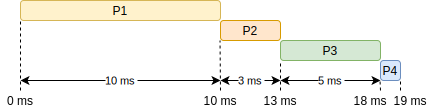
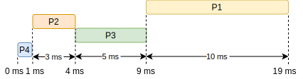
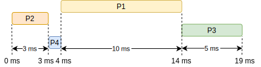
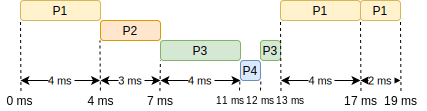
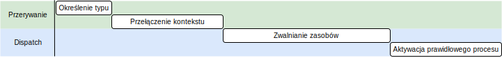

\title{Kolejkowanie przez procesor}
\author{Patryk 45118641800f7466ecce781cbda2de6f6d79eca9}
\date{30 Dec 2021}

\renewcommand*\contentsname{Spis treści}

\maketitle
\tableofcontents

\newpage

# Wstęp

Kolejkowanie procesów przez procesor jest podstawą systemów wykorzystujących wiele operacji. Przełączanie się pomiędzy procesami zwiększa wydajność systemu operacyjnego. W tej notatce przedstawione zostaną algorytmy, koncepcje oraz problemy kolejkowania.

# Podstawowe koncepcje

W procesorach jedno rdzeniowych, w danej chwili wykonywany może być jeden proces. Celem algorytmu kolejkowania jest jak najlepsze rozłożenie procesów, aby procesor był wykorzystywany w jak największym stopniu.

## Serie cykli CPU — I/O

Gdy proces rozpoczyna swoje działanie na procesorze, zajmuje czas CPU. Podczas obliczeń może zarządzać zasobów I/O, na których dostęp musi poczekać. Oczekiwanie na I/O wyłącza chwilowo procesor z użycia. Przejście między stanem pracy (używaniem CPU) a obsługą urządzeń I/O nazywa się cyklem. Suma całego czasu użytkowania procesora nazywana jest *serią CPU* (**CPU burst**), I/O natomiast *serią I/O* (**I/O burst**).

## Kolejkowanie przez procesor

Po zakończeniu wykonywania się jednego procesu procesor zostaje wolny. W tym momencie system operacyjny musi wybrać kolejny proces do wykonania. Taki proces wybierania kolejnego procesu nazywa się *krótkoterminowym kolejkowaniem* (**short-term scheduler**) lub *kolejkowaniem przez procesor* (**CPU scheduler**).

Gotowe procesy do wykonania znajdują się w kolejce. Kolejka taka najczęściej składa się z PCB. Dodatkowo nie narzuca się specjalnego typu kolejki. Elementy z niej mogą być wybierane w różnej kolejności, zależnie od "decyzji" algorytmu kolejkowania.

## Przerywane kolejkowanie

Proces ponownego kolejkowania odbywa się gdy:

1.  Proces przeszedł ze stanu *wykonywania* do *oczekiwania*. Przykładowo, oczekiwania na zasoby I/O
2.  Proces przeszedł ze stanu *wykonywania* do *gotowy do wykonania*. Sytuacja taka następuje, gdy dochodzi do przerwania przez otrzymany sygnał z zewnątrz procesu.
3.  Proces przeszedł ze stanu *oczekiwania* do *gotowy do wykonania*. Przykładowo po zakończeniu operacji I/O.
4.  Proces się zakończył.

Gdy do kolejkowania dochodzi w przypadkach **1** oraz **4**, kolejkowanie nazywa się nieprzerywanym. W pozostałych przypadkach kolejkowanie jest przerywane.

## Dyspozytor procesów

Po wybraniu przez algorytm kolejkowania, procesu do wykonania, uruchamiany jest skrypt *dyspozytora* (**dispatcher**). Jego zadaniem jest zwolnić wymagane zasoby oraz przełączyć kontekst na zadany proces. Operacje, jakie wykonuje to: czyszczenie rejestr procesu, zmienna pamięci wirtualnej, przejście na poziom kodu użytkownika (*user mode*) oraz rozpoczęcie wykonywania kodu od ostatniego punktu zatrzymania.

Ostatnim punkt zatrzymania zapisywane jest w *liczniku programu* (**program counter**).

Opóźnienia wynikające z operacji dyspozytora, nazywa się **dispatch latency**.

# Kryteria kolejkowania

Efektywność kolejkowania mierzy się różnymi parametrami. Dla systemów czasu rzeczywistego będą to inne niż dla systemów baz danych.

Podstawowymi kryteriami są/jest:

- **Zużycie procesora** (*CPU Utilization*) Przedstawia stopień wykorzystania procesora.
- **Wydajność** (*Throughput*) Określa, ile procesów zostało ukończonych w danym przedziale czasowym. Dla lekkich procesów ten wskaźnik może wskazywać 10 procesów na sekundę. Dla ciężkich procesów może to być nawet 1 proces na godzinę. Co nie jest jednoznacznym wskaźnikiem.
- **Czas realizacji** (*Turnaround time*) Jest to czas, jaki upłynął od utworzenia procesu do jego zakończenia.
- **Czas oczekiwania** (*Waiting time*) Jest to czas, jaki proces spędza w kolejce do wykonania.
- **Czas odpowiedzi** (*Response time*) W procesach interaktywnych rezultat działania procesu nie jest zwracany jednorazowo. Oznacza to, iż jeden wynik działania procesu może występować w pewnym odstępie czasu. Ten parametr w przeciwieństwie do *czasu realizacji* trwa do momentu zwrócenia pierwszej odpowiedzi, a nie do zakończenia procesu.

# Algorytmy kolejkowania

## First-Come, First-Served (FCFS)

Jest to najprostszy algorytm kolejkowania. Działa on na zasadzie zwykłej kolejki FIFO. Oznacza to, iż kolejnym procesem do wykonania jest ten z najdłuższym czasem oczekiwania w kolejce.

Przykładowy rozkład wykonania procesów:

| Proces | Wymagany czas |
| --- | --- |
| P1  | 10ms |
| P2  | 3ms |
| P3  | 5ms |
| P4  | 1ms |

Wadą takiego rozkładu procesów jest długi *czas oczekiwania*. P1 oczekuje 0ms, P2 10ms, P3 13ms, P4 18ms, co daje średnią (0+10+13+18)/4 = 41/4 = 10.25ms.

## Shortest-Job-First (SJF)

Jest to rozwiązanie problemu kolejkowania *FCFS*. Ten algorytm w pierwszej kolejności ustawia procesy z najkrótszym *czasem wykonywania* (jest to *czas realizacji* bez późnień).

| Proces | Wymagany czas |
| --- | --- |
| P1  | 10ms |
| P2  | 3ms |
| P3  | 5ms |
| P4  | 1ms |

*Czas oczekiwania* w tym wypadku wygląda lepiej. P1 oczekuje 9ms, P2 1ms, P3 4ms, P4 0ms, co daje średni czas na poziomie (9+1+4+0)/4 = 14/4 = 3.5ms.

Problemem tego algorytmu jest ustalenie czasu wykonania procesu. Można do tego wykorzystać przewidywaną wartość czasu procesora, jaka zostanie przydzielona do kolejnego wykonywanie takiego procesu.

Wzór, jakim opisuje się przewidywany czas cyklu procesu to: Tn+1 = α \* tn \+ (1 − α)Tn

Gdzie:

- T - Przewidywany czas cyklu procesu. Początkowo równy dowolnej wartości.
- t - Faktyczny czas cyklu.
- n - Numer cyklu.
- a - Współczynnik zamiany, który określa wpływ długoścu cyklu na przewidywaną długość. Wartość w zakresie 0 < a < 1.

## Priority (Priorytet)

Procesy w tym algorytmie kolejkowania mają dodatkową wartość, jaką jest priorytet. Przedstawiany jako wartość liczbowa, której zakresu i kierunku priorytetu są określane przez standard lub implementację. Pierwszeństwo w takiej kolejce ma zawsze proces o najwyższym priorytecie.

| Proces | Wymagany czas | Priorytet |
| --- | --- | --- |
| P1  | 10ms | 3   |
| P2  | 3ms | 1   |
| P3  | 5ms | 4   |
| P4  | 1ms | 2   |

Problemem takiego algorytmu może być nieskończone blokowanie. Występuje ono, wtedy gdy dochodzą procesy o większym priorytecie i zabierają zasoby. Rozwiązaniem takiego problemu jest okresowe zwiększanie priorytetu, przykładowo co 15sec o 1 stopień.

Taki algorytm nie jest wydajny, jest natomiast użyteczny, gdy rozpatrujemy systemy czasu rzeczywistego. Gdyż w takich systemach wywołane ważne operacje muszą jak najszybciej zwrócić wynik, co relatywnie łatwo jest osiągnąć przy użyciu tego algorytmu.

## Round-Robin (Algorytm cykliczny skrót RR)

Algorytm ten działa na zasadzie *FCFS*, dodatkowo przerywając proces co określony czas. Maksymalny czas serii procesora dla procesu oznacza się jako *interwał czasu* (**time slice**). Po przekroczeniu tego czasu procesor przerywa działanie procesu i umiejscawia go na końcu kolejki. W miejsce zatrzymanego procesu wchodzi kolejny. Jeżeli proces przerwie lub skończy działanie przed upływem *interwału czasu*, to jego miejsce zajmuje kolejny proces, a odliczanie do przerwania procesu jest resetowane.

*Interwał czasu* często zawiera się w zakresie od 10ms do 100ms. Rozpatrzmy 4ms interwał:

| Proces | Wymagany czas |
| --- | --- |
| P1  | 10ms |
| P2  | 3ms |
| P3  | 5ms |
| P4  | 1ms |

P1 oczekiwał (0 + 13-4 + 17-8) = 18ms, P2 4ms, P3 (7 + 12-4) = 15ms, P4 11ms, średni czas oczekiwania procesów wyniósł (18 + 4 + 15 + 11)/4 = 48/4 = 12ms.

Algorytm ten nie osiąga najkrótszego *czasu oczekiwania*, zato równomiernie rozdziela zasoby.

## Multilevel Queue (Wielopoziomowa kolejka)

Procesy można podzielić na kilka kategorii. Każda kategoria może wymagać innego algorytmu kolejkowania. Przykładowo, procesy jądra systemowego powinny być wykonywane w kolejce FCFS, procesy interaktywne w RR, procesy w tle SJF. W algorytmie *wielopoziomowej kolejki* istnieje wiele kategorii procesów, każda kategoria podaje swój jeden proces do wykonania. Procesy są wybierane według ustalonego schematu, może to być RR z różnym *interwałem czasu* dla określonych kategorii procesu.

## Multilevel Feedback Queue (Wielopoziomowa kolejka z informacją zwrotną)

Kolejka ta jest podobna do *wielopoziomowej kolejki*, jej różnicą jest inny podział kategorii oraz możliwość przechodzenie procesów między nimi. Celem tej kolejki jest najsprawiedliwsze współdzielenie zasobów. Nie jest to możliwe, gdy kilka procesów nadużywa CPU lub I/O. Ten algorytm kolejkowania ma za zadanie wyłapać takie procesy i umieścić je w innych kolejkach. Przykładowo, jeśli jeden proces zajmuje w większości CPU, powinien zostać przeniesiony do kolejki, gdzie ten przydział czasowy jest niższy.

# Kolejkowanie wątków

Każdy proces jest w relacji z wątkiem jądra systemowego, są to relacje: jeden do wielu, wiele do wielu oraz jeden do jednego. Za kolejkowanie wątków odpowiada proces, w standardzie POSIX, realizowane jest to z pomocą biblioteki Pthread. Można to zmienić poprzez stworzenie kilku procesów *LWP*. Proces *LWP* (Light Weight Process) składa się wyłącznie z jednego wątku, cała jego pamięć jest współdzielona z innymi procesami *LWP*. W taki oto sposób logicznie mamy jeden proces, który obsługuje wiele wątków, fizycznie natomiast, istnieje tyle wątków co procesów, współdzielących pamięć.

## Zakres połączeń

Jeśli między jądrem systemowym a procesem, wykorzystuje się relację *jeden do wielu* lub *wiele do wielu*, oznacza to, iż biblioteka wątków będzie miała za zadanie sama się przełączać między nimi. Podobna sytuacja występuje, gdy używana jest relacja *jeden do jednego* na procesach wielowątkowych.

Gdy wykorzystywana jest relacja *jeden do jednego* na procesach *LWP*, to system będzie odpowiedzialny za kolejkowanie wątków.

Sytuacja, w której proces odpowiada za kolejkowanie wątków, nazywa się *process-contention scope* (PCS). Natomiast kolejkowanie wątków przez jądro systemowe, nazywane jest *system-contention scope* (SCS).

## Kolejkowanie poprzez Pthread

Standard POSIX pozwala na wybranie *zakresu połączeń*. *Process-contention scope* identyfikowany jest przez stałą **PTHREAD\_SCOPE\_PROCESS**, *system-contention scope* przez **PTHREAD\_SCOPE\_SYSTEM**.

Aby sprawdzić aktualny tryb, należy skorzystać z funkcji [`int pthread_attr_getscope(const pthread_attr_t *restrict attr, int *restrict scope);`](https://man7.org/linux/man-pages/man3/pthread_attr_getscope.3.html). W celu zamiany trybu kożysta się z [`int pthread_attr_setscope(pthread_attr_t *attr, int scope);`](https://man7.org/linux/man-pages/man3/pthread_attr_setscope.3.html).

# Kolejkowanie na wielu procesorach

Używanie wielu procesorów pozwala na zwiększenie wydajności prowadzonych operacji. W systemach obsługujących tylko jeden procesor, możliwe było używanie standardowych kolejek.

Jednym z problemów wykorzystywania wielu procesorów jest problem z kolejkowaniem. Wynika on głównie z rozdzielenia pamięci procesora (Cache L1, L2, …), co prowadzi do spowolnienia obliczeń, jeżeli proces został przeniesiony do innego procesora.

Zaletą jest zwiększenie wydajności obliczeń, dodatkowo można logicznie podzielić zadania procesorów. Przykładowo, jeden zajmuje się operacjami I/O oraz uruchamianiem jądra systemowego, drugi natomiast uruchamia aplikacje użytkownika.

## Planowanie kolejkowania na wielu procesorach

Algorytm kolejkowania może obsługiwać wiele procesorów, poprzez co możliwe jest przenoszenie procesów. Takie przenoszenie może być zastosowane do kategoryzowania procesów, tak jak ma to miejsce w algorytmie *Multilevel Queue*. Algorytm taki nazywa się asymetrycznym (*asymmetric multiprocessing*).

Gdy każdy procesor, posiada swój algorytm kolejkowania, nazywany jest symetrycznym (*symmetric multiprocessing*).

## Ograniczenie migracji procesów

Algorytmy asymetryczne mogą ograniczać przechodzenie procesów między procesorami. Proces taki nazywany jest **processor affinity**. Celem takiego ograniczenia jest zachowanie tego samego cache’u procesora.

W systemach standardu POSIX opcja taka aktywowana jest z pomocą funkcji [`int sched_setaffinity(pid_t pid, size_t cpusetsize, const cpu_set_t *mask);`](https://man7.org/linux/man-pages/man2/sched_setaffinity.2.html).

## Rozkład obciążenia

Procesory mogą być nierówno obciążone, efektem czego, wyniki niektórych procesów mogą pojawiać się z opóźnieniem. Rozwiązaniem takiego problemu jest rozkład obciążenia (*Load Balancing*). Proces dokonujący rozkładu przetwarza informacje o procesach, a następnie je wybiera i przenosi na inny procesor.

## Wielordzeniowe procesory

Dużym usprawnieniem jest umieszczenie kilku procesorów logicznych w jednym chipie. Pozwala to na współdzielenie pamięci procesora, co rozwiązuje problem przenoszenia procesów między procesorami. Taki jeden procesor logiczny nazywany jest rdzeniem.

# Kolejkowanie w systemach czasu rzeczywistego

Wykorzystywanie systemów czasu rzeczywistego wytwarza nowy problem. Operacje, jakie mają zostać wykonane, muszą zakończyć się przed określonym czasem, tzw. **deadline**.

Wydajność takich systemów określa się poprzez opóźnienie odpowiedzi. W zależności od konsekwencji opóźnień wyróżnia się następujące rodzaje systemów:

- **Soft real-time systems** Opóźnienie odpowiedzi w takim systemie obniża jego wydajność.
- **Hard real-time systems** Opóźnienie odpowiedzi w takim systemie prowadzi do całkowitej awarii systemu.

Niektóre procesy czasu rzeczywistego wywoływane są w równych odstępach czasu. Taki okres miedzy wywołaniami procesów nazywa się **period**. Dodatkowo niektóre procesy mogą mieć bardzo zbliżony lub taki sam czas wykonywania. Takie własności procesów czasu rzeczywistego mogą pomóc w sprawniejszym kolejkowaniu procesów.

## Opóźnienia

Czas, jaki minął od wywołania wydarzenia do otrzymania wyniku, nazywany jest *opóźnieniem* (**event latency**). Taka wartość nie jest stała, gdyż wpływa na nią wiele cznynników.

**Event Latency** rozkłada się na mniejsze czynniki:

W pierwotnej fazie procesor określa typ przerwania i odczytuje z tablicy przerywań jego sekcję kodu. Następnie przełączany jest kontekst w celu wykonania kodu przerwania. Kod przerwania może sam wykonać operacje lub zlecić je innemu procesowi. Gdy pojawi się wymóg użycia zasobów zajmowanych przez inny proces, to dany proces uzyskuje on wyższy priorytet do momentu zwolnienia tego zasobu.

## Kolejkowanie z priorytetem

Zadaniem systemu czasu rzeczywistego, jest zwrócenie jak najszybciej odpowiedzi. Wymaga to zaimplementowania algorytmu wspierającego priorytety procesów oraz przerywania.

Priorytety procesów pozwalają na wcześniejsze wykonanie ważniejszych operacji. Procesy wykonujące obliczenia dla uzyskania odpowiedzi w systemach czasu rzeczywistego powinny mieć jak najwyższy priorytet.

Przerywanie pozwala przerwać działanie aktualnego procesu na rzecz innych. Jest to wymagane, aby jak najszybciej rozpocząć wykonywanie procesów czasu rzeczywistego.

## Monotoniczne kolejkowanie

Okresowe procesy czasu rzeczywistego, możliwe są do kolejkowania za pomocą zwykłego algorytmu z priorytetami. Kolejkowanie takie powinno dodatkowo uwzględniać trzy parametry: czas wykonania (względem poprzednich wykonań tego procesu), okres oraz *deadline*.

Kolejność procesów czasu rzeczywistego, dodatkowo powinna być wybierana według takiej kolejności:

1.  Krótszy okres
2.  Większy priorytet
3.  Dłuższy okres
4.  Mniejszy priorytet

Przykład dla dwóch procesów:

| Proces | Priorytet | Czas wykonywania | Deadline | Okres |
| --- | --- | --- | --- | --- |
| P1  | 100 | 20ms | 40ms | 50ms |
| P2  | 10  | 35ms | 80ms | 100ms |

## Wcześniejszy deadline

Innym sposobem kolejkowania jest **Earliest-deadline-first** (**EDF**). Jest to inna odmiana algorytmu z priorytetem. Priorytet w tym przypadku jest dynamiczny. Celem tego algorytmu kolejkowania jest wykonanie procesu, który posiada swój *deadline* najwcześniej. Oznacza to, iż priorytet jest odwrotnie proporcjonalny do *deadline*'u (im dalej deadline, tym niższy priorytet).

## Porcjowane kolejkowanie

Proces posiadający stały czas wykonywania oraz okresowość może posiadać statyczny przydział zasobów. Algorytm **proportional share** dzieli czas procesora na równe części, które przypisuje określonemu procesowi. Przykładowo, proces P1 wykonuje swoje obliczenia przez 4ms co 10ms, proces P2 natomiast przez 8ms co 15ms. Oznacza to, iż P1 musi zająć przynajmniej (4ms/10ms=0.4) 40%, a P2 (8ms/15ms=0.5333) 53,33%, wszystkich zasobów czasu procesor. Wolne pozostaje 7,66% dla innego procesu.

# Bibliografia

---
notice: |
	@Silberschatz2006
...