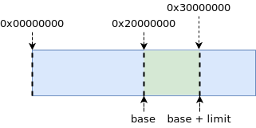
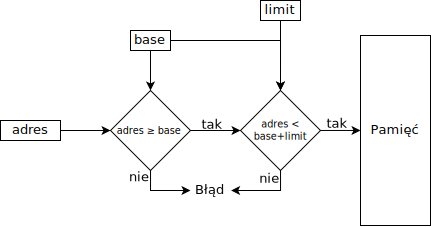
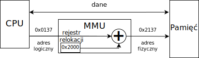
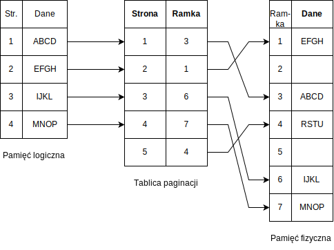
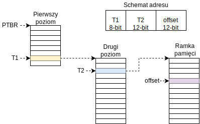

\title{Pamięć Operacyjna}
\author{Patryk 45118641800f7466ecce781cbda2de6f6d79eca9}
\date{25 Jan 2022}

\renewcommand*\contentsname{Spis treści}

\maketitle
\tableofcontents

\newpage

# Wstęp

Pamięć operacyjna jeden z najważniejszych elementów komputera, bez których procesor nie mógłby sprawnie wykonywać swoich działań. Lecz w świecie systemów ogólnego użytku, procesy nierównomiernie zajmują pamięć.

W tej notatce przedstawione zostaną metody układu pamięci wraz z zabezpieczeniami. Całość zostanie poparta krótkim przykładem działania procesorów architektury AMD64 oraz IA-32.

# Działanie pamięci

Pamięć to tablica bajtów, gdzie każdy ma bajt swój adres. Komunikacja między pamięcią operacyjną a procesorem odbywa się poprzez trzy magistrale:

- **sterująca** informuje pamięć czy dane mają być odczytywane, czy zapisywane.
- **adresowania** informuje pamięć, w jakim miejscu w pamięci podejmowane są operacje.
- **danych** służy przekazywaniu danych z lub do pamięci.

Maksymalny rozmiar pamięci operacyjnej jest określany przez ilość bitów adresowania[^AMD-V1-2.1.3].

Procesor pobiera z pamięci operacyjnej instrukcje w zależności od wskaźnika instrukcji (*Program Counter*). Do każdej instrukcji pobrane mogą zostać dodatkowe argumenty w zależności od wykonywanej instrukcji. Z punktu widzenia pamięci operacyjnej nie wiadomo które wartości są instrukcjami, a które danymi. Można jednak to stwierdzić, analizując dane pod względem występowania prawidłowych operacji.

## Cache

Procesor może przechowywać dane w rejestrach ogólnego przeznaczenia lub w pamięci operacyjnej. Dostęp do rejestru to zazwyczaj 1 cykl procesora. W celu pobrania danych z pamięci operacyjnej wymagane jest skorzystanie z magistrali, co może zająć wiele cykli. Powodem takiego opóźnienia jest czas dostępu do pamięci, gdyż pamięć potrzebuje kilka dodatkowych cykli zegara (*CAS latency*), aby rozpocząć odczytywanie danych. Rozwiązaniem tego problemu jest wykorzystanie **cache**’u który jest szybką pamięcią umieszczoną na tym samym chipie co procesor. Pamięć operacyjna ma pojemność kilkunastu gigabajtów, cache kilkunastu megabajtów a rejestry mają od 8 do 256 bitów. *Cache* jest uzupełniany sprzętowo bez ingerencji systemu operacyjnego.

## Ochrona dostępu

Procesy należące do różnych użytkowników w systemie powinny działać niezależnie. Niekiedy nawet procesy tego samego użytkownika nie powinny ingerować w swoją pamięć. Aby zapewnić takie działanie, procesy muszą mieć wyłączność na określony fragment pamięci. Gdy proces wykona pobieranie danych z pamięci, adres, na którym wykonuje daną operację, zostanie sprawdzony. W celu sprawdzenia adresu procesory wykorzystują dwa dodatkowe rejestry, jeden zawierający adres początku fragmentu pamięci oraz drugi zawierający długość fragmentu pamięci. Rejestr zawierający początek fragmentu nazywany jest *podstawą* (**base**), a zawierający długość, *granicą* (**limit**). Rejestry te mogą być modyfikowane wyłącznie w *kernel mode* (przez system operacyjny), na poziomie użytkowniczka (*user mode*) możliwe jest tylko odczytanie tych rejestrów.

Przykładowo, pamięć może mieć 1024 MiB, a procesowi przydzielony został fragment o długości 256 MiB zaczynający się na adresie 0x20000000 (512 MiB od początku). Schemat pamięci wygląda następująco:

{ width=50% }

Algorytm sprawdzania poprawności dostępu do pamięci wygląda następująco:

{ width=70% }

## Przydzielanie pamięci procesowi

System operacyjny tworząc nowy proces, musi przydzielić mu określoną pamięć. Taka pamięć nie może się pokrywać z pamięcią innego procesu. Z tego wynika iż zadaniem systemu operacyjnego jest znalezienie wystarczająco dużego fragmentu nieużywanej pamięci aby umieścić w nim nowy proces. Tak ciągły fragment nieużywanej pamięci nazywany jest dziurą. Procedura wybierania dziury dla procesu jest tym samym co *problem dynamicznie alokowanej pamięci*. A takowe dziury można wybierać na 3 sposoby:

- **First fit**. Jest to pierwsza znaleziona dziura w pamięci, w której mieści się proces.
- **Best fit**. Jest to dziura, w której mieści się proces, ale jest najmniejsza z dostępnych.
- **Worst fit**. Alokowana dziura jest jak największa ze wszystkich dostępnych.

Algorytmy alokacji pamięci co do jednego byte’a są bardzo nieoptymalne. Wynika to z potrzeby sprawdzania ogromnej ilości zakresów adresów. Rozwiązaniem takiego problemu jest podział pamięci na bloki o stałej długości, przykładowo 4KiB, tak jak ma to miejsce w większości systemów ogólnego przeznaczenia. Podział na bloki pozwala na utworzenie binarnej mapy alokacji, gdzie jeden bit wskazuje zajętość bloku. Taka mapa dla 4KiB bloków i 4GiB będzie miała rozmiar 1 048 576 bajtów, co jest równe 128KiB. Przeszukiwanie takiej ilości danych jest szybsze niż "skakanie" po pamięci, którego efektem ubocznym jest nienajlepszy dobór cache'owanych danych.

Innym problemem przedstawionego przydzielania pamięci procesowi może być brak wystarczająco dużo ciągłej wolnej przestrzeni. Przykładowo, w systemie możne powstać proces, który wymaga 1GiB pamięci operacyjnej, natomiast ilość wolnej pamięci operacyjnej to 2GiB. Nie ma z tym żadnego problemu do momentu nieznalezienia wystarczająco dużej dziury. Mianowicie w pamięci może być 5 dziur o łącznej pojemności 2GiB, bez gwarancji istnienia przynajmniej jednej, większej lub równej 1GiB. Metodami rozwiązującymi takie problemy jest *segmentacja* lub *paginacja*.

# Metody ładowania procesów

Proces przed swoim wykonaniem ładowany jest do pamięci operacyjnej. W zależności od potrzeb można rozważyć dwie metody ładowania, statyczną oraz dynamiczną.

## Statyczne

Metoda statyczna ładowania procesu polega na zapisaniu w pamięci całego kodu wykonywalnego.

Rozwiązanie takie wykorzystuje dużą ilość pamięci operacyjnej, gdyż ładowane są funkcje, które mogą zostać nigdy nieużyte. Zaletą jest natomiast nieprzerwane działanie programu ze względu na wymagany kod.

## Dynamiczne

Dynamicznie ładowany proces może w dowolnym momencie poprosić system operacyjny o załadowanie dodatkowej biblioteki.

Funkcjonalność taka ma za zadanie zmniejszyć zużycie pamięci operacyjnej o nieużywane funkcje. Dodatkowo proces ładowania części programu do pamięci jest szybszy od ładowania całości. Szybsze załadowanie programu do pamięci pozwala na jego wcześniejsze wykonanie.

Systemy bazujące na standardzie POSIX, mogą skorzystać z metod:

- `void *dlopen(const char *file, int mode);` [^MAN7-dlopen] – Ładuje bibliotekę wskazywaną przez parametr *file*.

- `int dlclose(void *handle);` [^MAN7-dlclose] – Odłącza bibliotekę wskazywaną przez parametr *handle*.

# Przestrzenie adresowe

Rozróżnia się dwa typy adresów, są to adresy fizyczne oraz logiczne, nazywane też wirtualnymi. Wszystkie adresy logiczne wygenerowane przez procesor należą do zbioru *logicznej przestrzeni adresowej* (**logical address space**). Adresy fizyczne należą do *fizycznej przestrzeni adresowej* (**physical address space**).

## Adresy fizyczne

Adres fizyczny to adres, jakim posługuje się pamięć operacyjna, aby określić miejsce zapisu lub odczytu danych. Jego maksymalnym zakresem jest fizyczna wielkość pamięci oraz szerokość magistrali adresacji. Przykładowo, pamięć posiada rozmiar 2GiB co jest równe 0x80000000 B więc 0x80000000 jest maksymalnym adresem dla takiej pamięci. Natomiast gdy pamięć operacyjna ma rozmiar większy niż 4 GiB, a adresy obsługiwane przez procesor są 32-bitowe, to niemożliwym jest zaadresowanie większego adresu aniżeli 2^32.

## Adresy logiczne

Adres logiczny jest wykorzystywany przez proces, aby zapisać lub odczytać dane. Jest on prawie zawsze różny od adresu fizycznego i służy do ochrony pamięci. Jedynym wyjątkiem, gdy adres logiczny pokrywa się z fizycznym, jest tryb pracy. Mianowicie, system operacyjny realizuje swoje zadania w trybie *kernel mode* który może uzyskać dostęp do pamięci poprzez adresy fizyczne. Jest to wymagane do załadowania kodu programu przed jego uruchomieniem w jego fragmencie pamięci.

Adresy logiczne są tłumaczone na adresy fizyczne. Realizowane jest to przez moduł *memory-management unit* (**MMU**). *MMU* może obsługiwać wiele metod mapowania adresów, najprostszą jest relokacja. Polega ona na odczytaniu z rejestru przesunięcia pamięci, a następnie dodaniu tej wartości do adresu logicznego.

Przykładowo, jeśli wartość rejestru relokacji jest równa 0x2000 a adres logiczny 0x137, to adres fizyczny jest sumą rejestru relokacji oraz adresu logicznego. Adres fizyczny w takim przypadku jest równy 0x2137. Schemat:

{ width=70% }

# Przekierowywanie adresów

Zazwyczaj program w formacie pliku wykonywalnego znajduje się na dysku. Musi on zostać załadowany do pamięci, przed lub w trakcie wykonywania. Nowo powstałemu procesowi zezwala się na wybranie dowolnego fragmentu pamięci, w którym ma zastać załadowany. Problematyczny możne być adres 0x00000000, gdyż na wielu architekturach sekwencja rozruchowa zamieszcza w tych okolicach dane tj. tablica segmentów pamięci czy też tablicę przerywań. W trakcie pisania kodu używa się nazw symbolicznych na adresy, są one zamieniane dopiero podczas procesu kompilacji. Kompilator może utworzyć dwa różne typy adresów, są to: relokowane i statyczne. Adresy statyczne są ustalane w momencie kompilacji, wskazują one zawsze na ten sam adres w pamięci. Adresy relokowane są generowane przed wykonaniem programu lub w trakcie jego wykonywania.

Generowanie adresów w różnych momentach ma swoje wady i zalety:

- *Podczas kompilowania.* Adresy generowane statycznie wymagają zawsze wolnego tego samego fragmentu pamięci. Nie wymagają one natomiast dodatkowych operacji generowania adresów przed rozpoczęciem działania procesu ani w jego trakcie. Gdy wymagana jest zmiana adresów, program musi zostać skompilowany na nowo.
- *Przed uruchomieniem procesu.* Adresy relokowane, generowane przed wykonaniem procesu, wymagają zamiany na adresy fizyczne. Pozwala to na ładowanie procesu do dowolnego fragmentu pamięci, co ułatwia przydzielenie pamięci. Niestety, gdy wymagana jest zmiana miejsca w pamięci z różnych powodów, proces musi zostać uruchomiony ponownie, aby dalej działać poprawnie.
- *W trakcie działania procesu.* Adresy relokowane, generowane podczas wykonywania programu, wymagają każdorazowej zamiany adresu relokowanego na adres fizyczny. Wielokrotne wykonywanie funkcji zamiany adresów może spowolnić proces. Pomimo tego taki sposób działania pozwala na przenoszenie fragmentów pamięci bez ryzyka uszkodzenia procesu.

# Linkowanie bibliotek

Linkowanie bibliotek polega na umieszczeniu kodu już istniejących funkcji do programu. Może się to odbywać w sposób statyczny lub dynamiczny.

## Statyczne linkowanie

Niektóre systemy operacyjne wspierają tylko statyczne linkowanie. Polega ono na umieszczaniu bibliotek w pliku wykonywalnym. Taka praktyka jest rzadko stosowana ze względu na języki programowania, które to często wymagają swoich bibliotek, przykładowo C wymaga libc. Wielokrotne ładowanie tych samych bibliotek zajmuje dużo pamięci, co nie jest pożądanym efektem.

## Dynamiczne linkowanie

*Biblioteki linkowane dynamicznie* dołączane są przez system operacyjny do wykonywanego kodu, dołączany jest mały fragment kodu nazywany **stub**’em. Jego zadaniem jest podmiana wszystkich aliasów metod biblioteki w kodzie na prawidłowe adresy. Dodatkowo podczas wykonywania, skrypt ten sprawdza, czy dana metoda z biblioteki znajduje się w pamięci, jeśli nie to ją ładuje.

Biblioteki mogą być aktualizowane z powodu występujących błędów lub chęci programistów do wprowadzenia nowych funkcjonalności. Niekiedy takie działania zmieniają działanie funkcji zawartych w bibliotece, co może doprowadzić do niekompatybilności między wersjami. Rozwiązaniem tego problemu jest używanie *bibliotek współdzielonych*. Porozwalają one na istnienie w pamięci tym samym bibliotekom, ale w różnych wersjach. Program dodatkowo musi zawierać informację o tym, jaką wersję biblioteki oczekuje.

# Pamięć SWAP

Pamięć operacyjna posiada ograniczoną wielkość. Bez względu na zajętość pamięci, system operacyjny może zechcieć uruchomić kolejny proces. Gdy algorytm kolejkowania zdecyduje, iż dany proces ma się wykonać, a nie ma wystarczająco dużo wolnej pamięci, musi dojść do jej zwolnienia. Operację taką wykonuje się poprzez zakończenie innego procesu lub przeniesienie jego fragmentu pamięci w inne tymczasowe miejsce. Takim tymczasowym miejscem jest dysk twardy, którego fragment nazywany jest **SWAP**’em.

Przy wyborze dysku, na którym ma znajdować się partycja *SWAP* należy zwrócić uwagę na prędkość przesyłu danych. Przykładowo, jeśli proces zajmuje 128MiB pamięci to przetransferowanie go na dysk o przepustowości 64MiB/s zajmie 2 sekundy. W obie strony opóźnienia osiągną 4 sekundy, co dla wielu systemów jest bardzo dużym czasem oczekiwania.

Pamięć *SWAP* łatwo jest zaimplementować, gdy proces wykorzystuje adresy relokacyjne, generowane podczas wykonywania. Pozwala to na umieszczenie procesu w dowolnym miejscu w pamięci po powrocie ze *SWAP*’a, przy jednoczesnym zachowaniu poprawności działania.

# Segmentacja

Bardzo często języki programowania logicznie rozdzielają dane programu na fragmenty nazywane *segmentami*. Przy takim podziale kod programu będzie znajdował się w innym miejscu aniżeli dane.

Przykładowo język C tworzy kilka segmentów, które zawierają:

1.  Kod
2.  Wartości zmiennych
3.  Stos FIFO dla każdego z wątków
4.  Standardową bibliotekę języka C

Do takich segmentów odwołuje się dwu wymiarowo, tzn. wykorzystuje się identyfikator segmentu oraz offset (przesunięcie), na jakim znajduje się żądana wartość/instrukcja. Segmenty mogą być zapisywane na liście, co wymaga używania identyfikatora liczbowego. Innym sposobem na identyfikację segmentu jest zapisywanie jego części podstawy w rejestrze. Architektury AMD64 oraz x86 dostarczają rejestry segmentów pamięci, zawierające adres początku segmentu z przesunięciem o 4bit’y. Przykładowo, jeśli rejestr segmentu danych *DS* jest równy 0x0200, to proszenie o wartość z offsetem 0x0137 zwróci wartość z adresu fizycznego 0x2137.

# Paginacja

Segmentacja pozwala być pamięci nieciągłą, lecz jest to ograniczone do momentu wykorzystania wszystkich segmentów. Paginacja natomiast dzieli pamięć operacyjną na bloki o stałej długości, które nazywa się *ramką* (**frame**), a ten blok po stronie procesu jest nazywany *stroną* (**page**).

## Podstawowe działanie

*Ramki* umieszczane są w tabeli nazywanej *tablicą paginacji* a jej identyfikatorem jest *strona*. Elementy te znajdują się w relacji jeden do wielu, czyli istnieć może wiele *stron* nawiązujących do tej samej *ramki*. Wartości pobierane są dwuwymiarowo, gdzie pierwszym wymiarem jest numer strony a drugim offset (przesunięcie), na jakim znajdują się dane.

Możliwe jest utworzenie trzeciego wymiaru paginacji, kiedy to każdy proces posiada swoją tablicę paginacji.

Przykładowy schemat logiczny paginacji, dla stron wielkości 4 znaków:

{ width=80% }

## Wsparcie sprzętowe

Procesory mogą na kilka sposobów wspierać paginacje. Sposoby te zależą od specyfikacji procesora.

Najłatwiejszym wsparciem paginacji przez procesor jest utworzenie wielu rejestrów, gdzie każdy z nich zawiera informacje o stronie pamięci. Przykładem takiego procesora jest PDP-11. Posiada on 16-bit'ową magistralę adresacji, a strony i ramki pamięci mają rozmiar od 32 do 4096 bajtów. Możliwe jest obsługiwanie jednocześnie do 48 stron pamięci, gdzie każda strona wykorzystuje dwa rejestry, jest to rejestr *Page Address Registers* (*PAR*) oraz *Page Descriptor Register* (*PDR*)[^PDP-11]. Rejestr *PAR* wskazuje na adres w pamięci, na którym zaczyna się ramka. Natomiast *PDR* zawiera dane tj.: wielkość strony, czy strona jest możliwa do nadpisania, uprawnienia oraz kierunek uzupełniania. W procesorze PDP-11 wykorzystuje się w sumie 96 rejestrów (48 PAR + 48 PDR) do obsługi paginacji.

Wyżej przedstawiona metoda jest ciężka do zaimplementowania dla procesorów o dłuższej szynie adresowej. Wynika to z drastycznego zwiększenia się ilości stron możliwych do utworzenia. W takim przypadku wykorzystuje się tablicę paginacji umieszczoną w pamięci operacyjnej. Jej adres jest zapisywany tylko w jednym rejestrze nazywanym *Page-Table Base Register* (**PTBR**). Dostęp do pamięci przy takiej metodzie wymaga w pierwszej kolejności odczytania rekordu z tabeli paginacji, a następnie odczytania wartości z właściwym adresem. Rozwiązanie to jest dobre, gdy rozważymy ciężkość implementacji, problemem jest jednak wymagany czas. Przykładowo, gdy czas dostępu do pamięci jest równy 100 ms, to cała procedura zamiany strony na adres ramki wraz z odczytaniem wartości zajmuje 200 ms.

W celu redukcji czasu dostępu między procesorem a pamięcią stosuje się pamięć cache. W przypadku paginacji jest to specjalny cache działający na zasadzie tablicy asocjacyjnej nazywany *Translation Look-Aside Buffer* (**TLB**). Dane w niej zawarte są aktualizowane cały czas. Mianowicie gdy *TLB* otrzyma zapytanie, o stronę, której nie posiada zapisanej, wykonywana jest procedura *TLB miss*. Gdy natomiast udało się odnaleźć stronę w *TLB* wykonywana jest procedura *TLB hit*, która zwraca adres. W czasie procedury *TLB miss* z pamięci operacyjnej odczytywana jest wartość nieznanej strony. Wartość ta zostaje zapisana w *TLB*, a w przypadku braku wolnego miejsca stosuje się różne algorytmy wybierające element do nadpisania. Algorytmy te są zależne od implementacji i nie ma konkretnego zalecenia co do ich działania, sięgają one od *najmniej używanego* przez *Round-Robin* do *losowego* elementu.

Podczas wspierania paginacji można używać dodatkowo identyfikacji przestrzeni adresowych poprzez wartość nazywaną *Address-Space Identifier* (**ASID**). Pozwala ona na określenie, który proces jest "właścicielem" strony pamięci. Wartość ta znajduje się w tabeli paginacji oraz w *TLB*. W przypadku niewykorzystywania *ASID*, w trakcie przełączania się procesów, *TLB* musiałoby zostać wyczyszczone lub sprawdzenie, czy proces ma dostęp do danej strony dla każdego z rekordów.

Sprawność działania akceleracji sprzętowej mierzy się z pomocą *efektywnego czasu dostępu* (*effective memory-access time*). Pozwala on na określenie ile średnio, procesor oczekuje na właściwe dane z pamięci operacyjnej. Pomiar wykonuje się poprzez wykorzystanie procentowego wykonania procedur *TLB hit* oraz *TLB miss*. Jak wiadomo podczas procedury *TLB hit* zwracany jest natychmiastowo adres, co pozwala na pobranie danych z pamięci w czasie jednego cyklu dostępu. Procedura *TLB miss* wykonuje natomiast dwa cykle dostępu do pamięci. W takim wypadku *efektywny dostęp* wylicza się poprzez sumę *TLB hit* i podwojonego *TLB miss*. Aby z tego uzyskać efektywny czas dostępu, należy pomnożyć otrzymaną wartość jako czas cyku dostępu do pamięci. Przykładowo, gdy *TLB* wykonuje w 80% procedurę *hit* oraz w 20% *miss*, to współczynnik *efektywnego dostępu* wynosi 120% (80% + 2\*20%). A gdy czas cyklu dostępu do pamięci wynosi 100ms to *efektywny czas dostępu* wynosi 120ms (120% * 100ms).

## Ochrona stron

Strony pamięci mogą mieć różne przeznaczenie. Mogą zawierać dane lub instrukcje. Odróżnianie tych dwóch typów stron jest ważne, gdyż rozpoczęcie wykonywania bloku danych przez procesor prowadzi do wykonywania nieprawidłowych instrukcji. W efekcie czego dochodzi do utraty spójności operacji. W większości procesorów wykonanie określonej ilości błędnych instrukcji w określonym czasie powoduje wysłanie przerwania lub nawet wysłania sygnału RESET (efekt taki jak po ponownym uruchomieniu komputera) do procesora. Aby ochronić się przed wykonaniem nieprawidłowej sekcji jako instrukcji, stosuje się dodatkowy bit, który określa czy strona pamięci jest wykonywalna.

Programy mogą posiadać dane, które są stałe. Dane te powinny być niemożliwe do nadpisania. W takim wypadku należy zabezpieczyć strony pamięci, wykorzystując dodatkowy bit określający czy strona *tylko do odczytu*.

Nie chcianym zachowaniem jest zajęcie przez proces dużej ilości pamięci, której nie wykorzystuje w pełni. Sposobem na rozwiązanie tego problemu jest limitowanie ilości stron pamięci, jakie może zająć proces. Często procesory posiadają rejestr nazywany *Page-Table Length Register* (**PTLR**), który określa maksymalną ilość stron możliwych do zajęcia przez dany proces.

## Strony współdzielone

W systemie operacyjnym może działać wiele procesów wykonujących ten sam program. Zakładając, że kod programu zajmuje 5 ramek pamięci a dane 3, możemy stwierdzić, iż 10 takich procesów zajmie 80 ramek pamięci (10 \* 8 ramek na proces). Bardzo często o ile nie zawsze kod programu jest niezmienny, tzn. nie można go nadpisać w trakcie jego wykonywania. Posiadając pewność, iż kod programu jest niezmienny, możemy zastosować współdzielenie pamięci a dokładnie stron zawierających kod. Takie współdzielenie pozwala na jednorazowe zajęcie 5 ramek, a pozostałe 3 ramki są alokowane osobno przez każdy proces. Takim oto sposobem zajętych zostaje 35 (5 kodu + 10 \* 3 danych) ramek.

Współdzielenie stron realizuje się poprzez przypisanie stron do jednej ramki, która zawiera współdzielone dane.

## Rozkład tablicy paginacji

Tablica paginacji może mieć różne rozmiary, zależą one od ilości stron pamięci oraz zapisywanych informacji. Dane, jakie są dołączane do stron pamięci, zależą od architektury procesora, zawsze jednak zapisywany jest adres ramki.

Tworzone tablice paginacji nie osiągają swojego maksymalnego rozmiaru. Wynika to głównie z fizycznych możliwości pamięci operacyjnych, gdyż na architekturze 64bit można zaadresować 2^64 bajtów, co jest równe 16 EiB (1 ExbiBajt = ~1 000 000 TB). Taka pamięć operacyjna jest aktualnie nieosiągalna, lecz logiczna tablica paginacji powinna uwzględniać takie adresy.

Przykładowa pełna tablica paginacji dla stron wielkości 4096 Bajtów oraz adresach 32-bitowych ma rozmiar nie mniejszy niż 4 MiB. Każdy rekord w takiej tablicy musi zawierać przynajmniej adres ramki, który dla adresów 32-bitowych jest 4 Bajtowy (1 Bajt = 8 bit). Większość procesorów posiadających takie adresy jest w stanie zapewnić na tyle dużo pamięci, aby tablica paginacji była ciągła oraz w pełni utworzona. Problem pojawia się przy procesach o większej magistrali adresacji. Ich maksymalny rozmiar tablicy rośnie do ogromnych wartości.

Rozwiązaniem ww. problemu jest stosowanie hierarchicznego rozkładu tablicy paginacji. Można skorzystać również z hash mapy, aby utworzyć nieskończenie nieciągłą tablicę paginacji. Zdarza się również iż procesory implementują odwróconą tablicę paginacji.

### Hierarchiczny rozkład

Hierarchiczny rozkład tablicy pozwala na podzielenie całej tablicy na mniejsze części i rozlokowywanie ich w różnych miejscach. Umożliwia to istnienie nieciągłej tablicy paginacji.

Taki hierarchiczny rozkład może mieć wiele poziomów. Sposób podziału tablic jest taki sam jak metoda podziału adresu IP na podsieci. Przykładowo, tablica dzielona na dwa poziomy logicznie podzieli adres na trzy części tj. pierwszy poziom, drugi poziom oraz offset. Zawsze ostatni poziom tablicy w hierarchii zawiera fizyczny adres ramki, a pozostałe poziomy zawierają adres kolejnej tablicy paginacji w hierarchii.

Przykładowy schemat rozkładu hierarchicznego tablicy paginacji:

### Hash mapowy rozkład

Hash mapa może zapisywać swoje rekordy w różnych miejscach w pamięci. Taka możliwość wynika z budowy rekordu oraz sposobu ich przeszukiwania. Każdy rekord składa się z wirtualnego adresu strony, adresu ramki oraz adresu kolejnego rekordu. Wirtualny adres strony jest generowany z pomocą funkcji hash'ującej ustalanej podczas implementacji. Natomiast wyszukiwanie konkretnej strony odbywa się poprzez sprawdzanie każdego kolejnego elementu w łańcuchu rekordów do momentu uzyskania zgodnych wirtualnych numerów stron.

Przedstawiony rozkład tabeli paginacji jest mało optymalny, lecz umożliwia istnienie nieciągłości tablicy. Dużą zaletą również jest sposób jej przeszukiwania. Pozwala on na ustalenie dowolnego identyfikatora strony pamięci bez większych komplikacji. W przypadku standardowej tablicy paginacji wymagane byłoby utworzenie wszystkich poprzedzających rekordów.

### Odwrócony rozkład

Odwrócony rozkład tablicy paginacji pozwala na lepsze zarządzanie pamięcią fizyczną przez procesor. Nie jest to jednak naturalny tryb działania paginacji, gdyż wymaga on odnalezienia numeru strony pamięci, aby wyznaczyć adres ramki pamięci. Dodatkowo rozkład ten umożliwia utworzenie wyłącznie relacji jeden do jednego między ramką a stroną pamięci, co utrudnia lub nawet uniemożliwia współdzielenie danych.

Rozkład ten realizuje się w sposób podobny do standardowej tablicy partycji. Rekordy identyfikuje się jednak numerami ramek, a nie stron. Rekordy natomiast nie zawierają numeru ramki a identyfikator strony. Identyfikator taki składa się z dwóch wartości, są to PID procesu oraz lokalny numer strony pamięci.

Schemat takiego rozkładu:

# Przykłady rzeczywistych procesorów

Początkowo w historii komputerów osobistych powszechne było używanie architektury *IA-32*. Posiadała ona 32-bitowe adresy, co pozwalało na zaadresowanie aż 4GiB pamięci. Wraz z rozwojem technologii, granica 4GiB drastycznie się przybliżała, co wymagało zmian w architekturze. Pierwotnie *AMD* rozpoczęło działania dążące do rozwiązania tego problemu poprzez utworzenie nowej architektury nazwanej *AMD64*. Intel w odpowiedzi opracował bardzo podobną architekturę 64-bitową nazywaną *Intel 64*. *Intel 64* oraz *AMD64* są kompatybilne między sobą, przez co powszechnie nazywa się je **x86-64**.

Architektura x86-64 wykorzystuje jednocześnie segmentację oraz paginację, które są rozdzielone na dwie logiczne części. Początkowo procesor generuje adres logiczny, który trafia do modułu segmentacji zwracającego adres liniowy. O trzymany adres liniowy trafia do modułu paginacji, który przekazuje ostateczny fizyczny adres do pamięci operacyjnej.

## Segmentacja

Architektura *AMD64* pozwala na utworzenie maksymalnie 16 384 segmentów pamięci[^AMD-V2-1.2.1] dla każdego procesu o maksymalnej wielkości równej 4GiB[^AMD-V2-1.2.1]. Informacje o segmentach zapisywane są w dwóch tablicach *Local Descriptor Table* (**LDT**) oraz *Global Descriptor Table* (**GDT**)[^AMD-V2-4.6]. Każda z nich może zapisać maksymalnie 8 192 rekordy. W tablicy *LDT* znajdują się informacje o segmentach, do których dostęp ma tylko i wyłącznie dany proces. Tablica *GDT* posiada natomiast segmenty współdzielone pomiędzy wiele procesów, służyć mogą one do komunikacji między procesami. W zależności od typu segmentu wykorzystuje się różne schematy rekordów w ww. tabelach[^AMD-V2-4.7.1]. Segmenty mogą reprezentować dane, jak i kod wykonywalny, przez co dobrą praktyką jest odróżnianie tych rekordów. Rozróżnienia dokonuje się poprzez dwunasty oraz jedenasty bit rekordu, jeśli bit jedenasty jest równy 1, to segment reprezentuje kod[^AMD-V2-4.7.2] w przeciwnym wypadku danymi[^AMD-V2-4.7.3], przy czym bit dwunasty musi być zawsze 1. W przypadku gdy bit dwunasty jest równy 0, oznacza to, iż segment jest systemowy[^AMD-V2-4.7.4].

Moduł segmentacji wymaga adresu składającego z *selektora segmentu* oraz offsetu. Selektor ten zawiera informacje o numerze segmentu (ostatnie 13 bitów), typie tabeli segmentów (trzeci bit) oraz o uprawnieniach do segmentu (pierwsze dwa bity)[^AMD-V2-4.5.1]. Po otrzymaniu selektora moduł segmentacji sprawdza, czy dane są poprawne i zwraca adres liniowy, który trafia do modułu paginacji.

## Paginacja

Paginacja na architekturze *x86-64* jest możliwa wyłącznie na odgórnie ustalonych wielkościach stron, są to: 4KiB, 2MiB oraz 4MiB[^AMD-V2-1.2.2]. Natomiast rozkład tablicy partycji jest hierarchiczny o różnej ilości poziomów, zależnej głównie od wielkości stron pamięci. Adres w pamięci, od którego zaczyna się tablica paginacji, jest zapisany w części rejestru *CR3*[^AMD-V2-5.2.1]. Z pomocą flagi *PAE*, dodać można dodatkowy poziom w rozkładzie hierarchicznym tablicy paginacji[@AMDV1]. W przypadku architektury AMD64 jest to wzrost z 48-bitów aż do 52[^AMD-V2-5.2.3].

## Inicjalizacja systemu

W zależności od metody uruchomieniowej komputera, we współczesnych komputerach jest to BIOS lub UEFI. Obydwie te metody prowadzą do rozpoczęcia wykonywania *boot sector*'a, który wykonuje odpowiednie operacje prowadzące do załadowania jądra systemowego. Jądro to powinno już samo załadować odpowiednie sterowniki oraz skonfigurować sprzęt.

Gdy nasz komputer jest uruchamiany z wykorzystaniem UEFI, nie musimy się martwić o przechodzenie między trybami procesora. Ta metoda bootowania wykonuje całą sekwencję inicjalizacji systemu za nas. Dodatkowo UEFI, udostępnia protokoły do wykonywania operacji tj. konfiguracja grafiki czy też dysku. BIOS również udostępnia swoje metody, lecz nie są one standaryzowane, tz. różni producenci płyt głównych implementują różne funkcje oraz ich numery przerywań.

W przypadku bootowania za pomocą BIOSu wymagane jest wykonanie pozostałych operacji inicjalizacji. Spowodowane jest to zakresem zadań BIOSu, który kończy swoje działanie po załadowaniu *boot sector*'a, który kontynuował będzie inicjalizację systemu.

Pierwszym etapem bootowania BIOS jest *RAM detection*. Polega on na sprawdzeniu ilości oraz typu pamięci RAM. Po wykryciu pamięci, sprawdzana jest jeszcze poprawność jej działania tz. czy nie jest uszkodzona. Gdy pamięć operacyjna działa poprawnie, BIOS ładuje dane i kod do *BIOS Data Area* (BDA) oraz *BIOS Area* (zakres pamięci 0xF0000 - 0xFFFFF). W następnej kolejności tworzy tablicę przerywań dla *Real Mode* (zakres pamięci 0x000 - 0x3FF) oraz zajmuje kawałek pamięci, który będzie pełnił funkcję stosu.

W drugim etapie, nazywanym *Hardware Detection/Initialization*, proces bootowania stara się wykryć oraz załadować komponenty komputera. Realizowane jest to poprzez sprawdzenie każdej magistrali, czy posiada jakieś urządzenie. W przypadku wykrycia jakiegokolwiek urządzenia, procedury BIOSu starają się doprowadzić sprzęt do stanu używalności. Taka konfiguracja sprzętu przez BIOS nie jest zawsze idealna, lecz system operacyjny ładowany w kolejnych etapach powinien zrobić to lepiej. Często zdarza się również że producenci sprzętu umieszczają pamięci ROM, które zawierają funkcje służące do obsługi urządzenia. W przypadku wykrycia takiej pamięci jest ona mapowana w pamięci operacyjnej.

Ostatnim etapem procesu bootowania jest ładowanie *boot sector*'a z dysku do pamięci. W pierwszej kolejności należy wybrać dysk. Dokonuje się tego poprzez odczyt pamięci CMOS, która zawiera w sobie kryteria odnośnie do wyboru dysku. W następnej kolejności BIOS przeszukuje dyski – posortowanych według kryteriów otrzymanych z CMOS – na których stara się odnaleźć *boot sector*'y. Mają one wielkość 512 B oraz kończą się bajtami 0xAA55. Pierwszy taki wykryty sektor jest ładowany do pamięci na adres 0x7C00.

Jeśli na którymś z wcześniej wspomnianych etapów wystąpił błąd, jest to sygnalizowane odpowiednią sekwencją dźwięku.

W tym momencie procesu inicjalizacji systemu kontrolę przejmuje programista. Jego pierwszym zdaniem jest ustabilizowanie środowiska. Polega ono na rozszerzeniu pamięci poprzez aktywację linii A20, gdzie w rzeczywistości daje ona dostęp do całej pamięci operacyjnej (Więcej na [wiki.osdev.org/A20_Line](wiki.osdev.org/A20_Line)). W następnej kolejności należy utworzyć tablicę segmentacji GDT, która pozwoli na relatywny dostęp do danych. Aby nie wygenerować błędu wyjścia poza pamięć fizyczną, należy aktywować paginację. Prowadzi to dodatkowo do przejścia w tryb *Protected Mode*, w którym można bezpiecznie załadować jądro systemu operacyjnego z dysku (adres dysku znajduje się w rejestrze DL).

# Bibliografia

[^PDP-11]: Dokumentacja [PDP-11](http://www.bitsavers.org/pdf/dec/pdp11/1194/EK-PDP94-MG-001_Sep90.pdf) sekcja 5.4

[^MAN7-dlopen]: Dokumentacjia POSIX - [dlopen](https://www.man7.org/linux/man-pages/man3/dlopen.3p.html)
[^MAN7-dlclose]: Dokumentacjia POSIX - [dlclose](https://www.man7.org/linux/man-pages/man3/dlclose.3p.html)

[^AMD-V1-2.1.3]: AMD Volume 1: 2.1.3 Physical Memory

[^AMD-V2-1.2.1]: AMD Volume 2: 1.2.1 Segmentation
[^AMD-V2-1.2.2]: AMD Volume 2: 1.2.2 Paging
[^AMD-V2-4.5.1]: AMD Volume 2: 4.5.1 Segment Selectors
[^AMD-V2-4.6]: AMD Volume 2: 4.6 Descriptor Tables
[^AMD-V2-4.7.1]: AMD Volume 2: 4.7.1 Descriptor Format
[^AMD-V2-4.7.2]: AMD Volume 2: 4.7.2 Code-Segment Descriptors
[^AMD-V2-4.7.3]: AMD Volume 2: 4.7.3 Data-Segment  Descriptors
[^AMD-V2-4.7.4]: AMD Volume 2: 4.7.4 System Descriptors
[^AMD-V2-5.2.1]: AMD Volume 2: 5.2.1 CR3 Register
[^AMD-V2-5.2.3]: AMD Volume 2: 5.2.3 PAE Paging

---
nocite: |
  @Silberschatz2006, @AMDV1, @AMDV2
...
